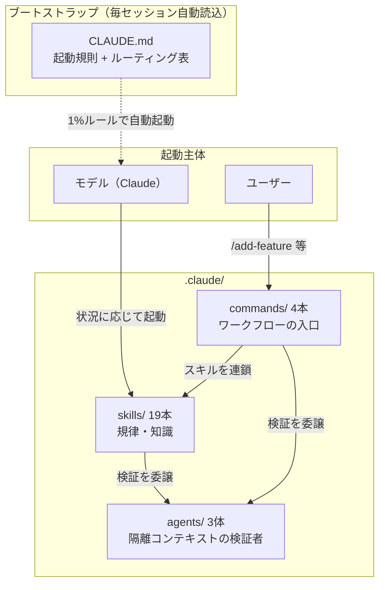
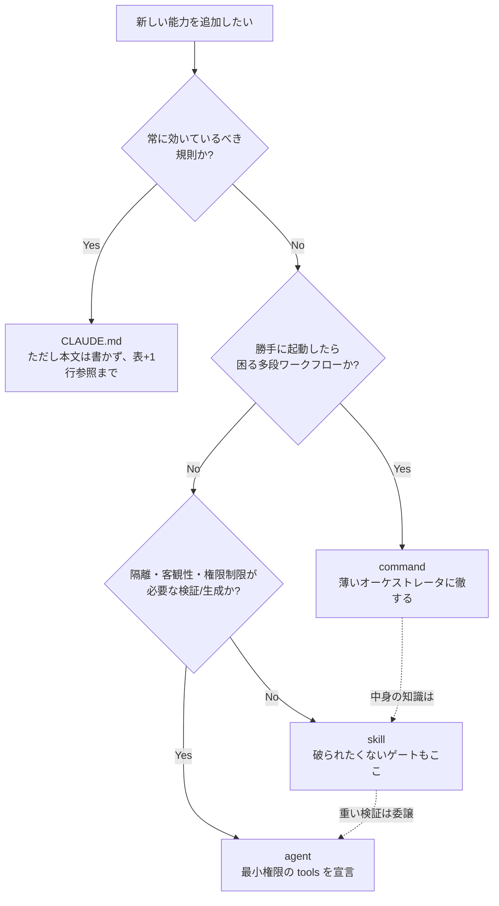
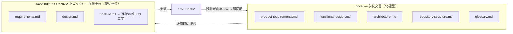
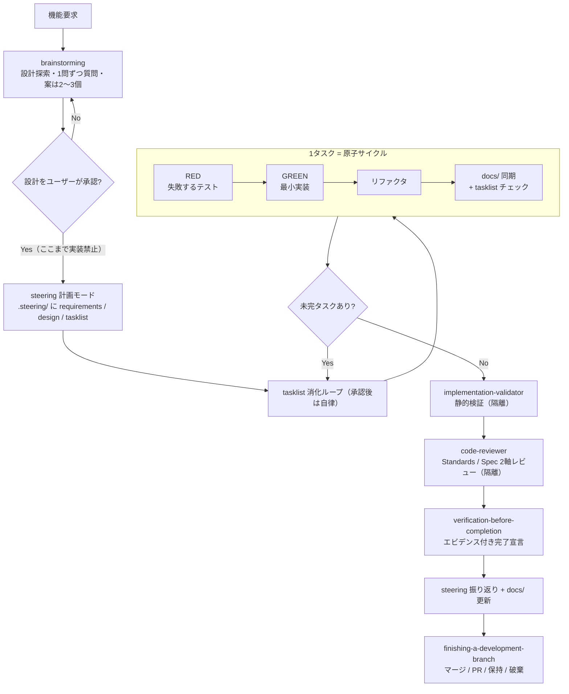

# Claude Code 開発基盤 設計書（上方・代書屋仕立て）

えー、こちらは設計書の**上方版**でございます。江戸前は [claude-infra-design.md](claude-infra-design.md)、
堅気の文は [claude-infra-design-plain.md](claude-infra-design-plain.md)、
同じ趣向の案内書は [.claude/README-daishoya.md](../.claude/README-daishoya.md) にございます。
中身の図・表・コマンドはどの版もおんなじで、語りだけが浪花でおます。

---

えー、「代書」の看板の店へ、また例のお人がやってまいります。

客「ごめーん! ごめんやっしゃー!」

代書屋「……この声は。またあんさんかいな」

客「先生! こないだの案内書、長屋で**えらい評判**だす! ほんで今度はな、
もひとつ上等のやつ。**設計書**ちゅうのを、ぽーんと」

代書屋「ぽーんは受けてまへん。……設計書て、何の設計だす」

客「へぇ、あの仕込み部屋そのものだす。『なんでこういう作りになっとるんか、
わけを書いた書付が欲しい』て、長屋の若いもんが言いますねや」

代書屋「ははあ、保守する人のための設計書だすな。よろしい、こら長丁場になりまっせ。
**聞かれたことだけ**答える、約束できまっか」

客「へぇ! 朝飯前だす!」

代書屋「あんさんの朝飯、昼過ぎだすやろ」

## 1. 目的と背景

代書屋「まず経緯から。この仕込みはな、その場しのぎの口伝(プロンプト)をやめて、
**再現できるプロセス**にするために、よそ様の流儀書きを三つ混ぜて拵えたもんだす」

客「三つ! どこの流儀だす」

代書屋「書きまっせ——」

| ソース | 性格 | 統合時の優先順位 |
|---|---|---|
| spec-driven | スペック駆動開発バンドル（日本語、Kotlin/Android 由来） | **1（本家）** |
| superpowers | 開発規律スキル集（英語、プラグイン形式） | 2（分家） |
| mattpocock/skills | 小さく合成可能なスキル集（英語） | 3（出入り） |

客「すぺっくどりぶん……てんぷらの衣の親戚だすか」

代書屋「違います! **仕様書を先に書いてから作る**流儀だす!
ほんでこの順位はな、**流儀同士が喧嘩したときの裁きの基準**。量の配分やおまへんで」

客「喧嘩! 喧嘩いうたら先生、うちも本家と、盆の墓参りの順番でもめにもめて」

代書屋「(筆を置いて)……その話、書きまっか?」

客「書かんでよろし」

代書屋「ほな喋りなはんな! ——蓋を開けたら『**骨格は本家 spec-driven、職人の性根は分家
superpowers、小技は出入りの skills-main**』ちゅう塩梅に収まった。喧嘩の裁定記録は
[§7](#7-衝突解決の記録) にまとめたある。ほんで注文はひとつ、
『丸写しやのうて、**この長屋で単体で動く**仕込みにせえ』。そこで素材ぜんぶに手を入れました」

1. すべて日本語に書き直した
2. Python 3.12 / pytest の環境に合わせて翻案した
3. プラグイン機構（フックや名前空間接頭辞）への依存を取り除いた
4. 既存の家訓（coding-conventions / writing-tests）と矛盾せんように調整した

客「ぱいそん……先生、それ、蛇だすやろ。長屋に蛇はかないまへんで」

代書屋「プログラミング言語だす! 蛇は出まへん!」

## 2. 全体アーキテクチャ

### 2.1 3層構造

代書屋「間取りはこないだの案内書と同じ三間。**心得（skills）・注文口（commands）・検査役（agents）**。
覚えてはりまっか」

客「任しとくなはれ! 心得と、**昆布**と、離れの検査役!」

代書屋「昆布と違う! 注文口! ……図にしときます、図に」



### 2.2 役割分担の軸

代書屋「層の分け方はな、『**誰が起動するか**』と『**どのコンテキストで走るか**』の二軸だす。
ほんで大事なんは、**どの層もタダ飯は食うてへん**、ちゅうこと」

客「へぇ! タダ飯食うてる層はおまへんのか。わてなら三日で見つかりますのに」

代書屋「あんさんの話はしてまへん! それぞれ払いがおますのや。
**どの払いなら安うつくかで、置き場所を決める**——これが眼目だす」

| 層 | 起動主体 | コンテキスト | 支払うコスト | 例 |
|---|---|---|---|---|
| skills | モデル（自動） | メイン会話に読み込む | 文脈消費（読み込むたび）→ description の精度が命 | `test-driven-development` |
| commands | ユーザー（`/` 明示） | メイン会話に読み込む | ユーザーの認知負荷（存在を覚える必要）→ 数を絞る | `/add-feature` |
| agents | モデル or commands | **隔離**（メイン文脈を汚さない） | 文脈の再構成コスト（履歴を持たないため依頼側が渡す） | `code-reviewer` |

代書屋「素朴な見立てなら『繰り返し使う規律 → skill、手順の長い仕事の入口 → command、
出力が長うて目の曇ったらあかん検分 → agent』（mattpocock/skills の設計論だす）。
そやけど実際の裁きには、もう三つの性質が効いとります」

- **強制可能性** — その決まりは「起動され損ねたら破られる」もんかどうか。破られたらあかん関所を、
  ユーザーの覚えに頼る command に置く法はおまへん
- **暴走リスク** — そいつが勝手に動き出したら困るかどうか。多段の自律仕事を
  自動起動の層に置いたら、そら暴れ馬だす
- **バイアスと権限** — 手前の仕事を手前で褒める目利きは信用でけん。目を離す、刃物を取り上げる、
  これを宣言で強制できるのは agent 層だけだす

客「先生、二つ目の暴れ馬て」

代書屋「話の弾みで機能追加が勝手に走り出す、ちゅうことだす。
気ぃついたら長屋が建て替わっとる、てなことになったら誰が困ります」

客「女房が帰ってこれまへん」

代書屋「まだ言うてる」

### 2.3 配置判断の記録 — 「この役割分担だから、これをこうした」

代書屋「ここが今日の眼目だっせ。**なんでそこに置いたか**を書き残しとかなんだら、
次に増やす人がまた鼻息で置きよる」

客「鼻息で置いたんは誰だす」

代書屋「……まあ、ぎょうさんおります。先例集だす、書きまっせ——」

| 対象 | 配置 | 判断理由 |
|---|---|---|
| brainstorming（設計先行ゲート） | **skill**（command にしない） | 関所ちゅうのは「ユーザーが `/brainstorm` と打ち忘れたら素通り」では話にならん。強制の要る決まりはモデルが自動で起動する skill 層へ。**関所は木戸やのうて職人の性根に彫り込む** |
| /add-feature・/refactor・/setup-project | **command**（skill にしない） | 多段の自律仕事が「機能っぽい話題」に釣られて勝手に走り出したら暴れ馬だす。ユーザーの明示の注文だけが妥当な引き金。逆に中身の知識は一切持たせず、skills を連ねるだけの薄い番頭に徹させた（§2.4 原則2） |
| requesting-code-review と code-reviewer | **skill + agent に分離** | 「いつ・何を持たせて頼むか」は繰り返しの作法 → skill。「どう診るか」（観点表・出力形式の長口上）+ 曇らん目 + 読み取り専用の縛り → agent。当初は skill が口上書きを抱えとったが、agent 定義との二重帳簿はかなんので agent 側へ一本化した |
| doc-reviewer / implementation-validator | **agent**（skill にしない） | 手前の書いたもんを同じ座敷で手前が検分したら、どうしたかて身贔屓が出ます。ほんで「読むだけ」「静的検証のみ・テスト実行禁止」ちゅう刃物の取り上げは、agent の tools 宣言でしか強制でけん |
| writing-plans / executing-plans（superpowers 原典では独立スキル） | **steering に吸収**（独立 skill にしない） | 計画→実行はひと続きの仕事で、正となる帳面（tasklist.md）も同じ。層を分けたら同じ知識が二箇所に積もって、片方だけ直されて食い違う。**帳面の正はひとつに寄せる** |
| coding-conventions / writing-tests | **skill**（CLAUDE.md に入れない） | 壁の掟書きに貼るには長すぎます（計 250 行超）。要るのはコード・テストを書くその瞬間だけ → 遅延ロード。掟書きには案内の一行だけ（§2.4 原則5） |
| 起動規則・ルーティング表 | **CLAUDE.md**（skill にしない） | 「スキルを引くための決まり」自体を skill にしたら、そいつを引く決まりが無い（自己参照で詰む）。常に座敷におらなあかん唯一の情報だす |
| refactoring | **skill と /refactor の両方** | 9原則の知識は「この関数直して」ちゅう注文口を通らん会話でも効かな嘘だす → skill。旦那はんが腰を据えてフルコース（steering 計画〜検証込み）を頼む入口 → command。**知識は skill、段取りは command** と分けたら重複せん |
| grill-me / grill-with-docs | **配置しない**（ユーザーレベル導入済み） | 同じ名前の職人を二人並べたら、どっちが出てくるやわからん |

客「先生、この表のいっちゃん上。関所を性根に彫り込む、て、痛おまへんのか」

代書屋「彫り物とちゃう! 物のたとえだす!」

### 2.4 敷衍: どういう設計でいくのがよいか

客「先例はわかりました。ほな先生、わてが今度なんぞ増やすときは」

代書屋「まずこの見立て図に通しなはれ。頭で考えるのはそれからだす」



客「ほな先生、例の『昼寝のすすめ』をこの図に通しまっせ。
常に効いてるべき規則か——**昼寝は常に効いてます!**」

代書屋「効いてまへん! 却下!」

客「へぇ〜、図に通したら一発だすな。便利なもんや」

代書屋「あんさんを止めるために作った図とちゃいますのやけどな……。原則も六つ、書いときます」

1. **関所（ゲート）は skill に置きなはれ** — command に置いた関所は「コマンドを使わなんだら」
   素通りできる木戸だす。強制したい規律は自動起動の層に置いて、command はそれを呼ぶだけにする
2. **command は薄う保ちなはれ** — command に知識を書き込んだら、その知識は command を通らん
   普段の会話で蔵入り（死蔵）だす。command の仕事は skill と agent を連ねる順序の定義、それっきり
3. **agent は最小権限 + ステートレス** — 検分役に鑿を持たせなはんな。検証役にテストを走らせなはんな。
   要る文脈（SHA 範囲・要求・変更概要）は頼む側が膳立てして渡しなはれ
4. **帳面の正はひとつ** — 同じ知識を二層に書きなはんな。書きとうなったら参照で繋ぐ
   （例: TDD の細目は `test-driven-development` が正、steering や command は名で呼ぶだけ）
5. **漸進的開示** — 文脈ちゅう座敷は広うおまへん。CLAUDE.md（1行）→ SKILL.md（本文）→
   guide/template（詳細）の三段構えで、読む用が生じたその時に初めて上がり込ませる
6. **分割は起動条件で、統合はライフサイクルで** — 出番の状況が違うんやったら別スキルに分ける
   （TDD とデバッグは別の瞬間に要ります）。同じ仕事のひと続きなら一本にまとめる
   （計画と実行を steering に統合した裁きがそれだす）

代書屋「置き間違えたときの祟りも書いときまひょ」

| アンチパターン | 何が起きるか | 正す先 |
|---|---|---|
| 規約・ゲートを command に書く | 普段の会話で規約が効かん。関所が素通りされる | skill へ |
| 重い自律ワークフローを skill にする | 話題に釣られて勝手に発火、暴れ出す | command へ |
| レビュー観点・検証手順を skill 本文に抱える | 座敷（メイン文脈）に居座られた挙句、身贔屓レビュー | agent へ |
| CLAUDE.md に本文を詰め込む | 毎朝の読み上げが長うなって、肝心の掟が埋もれる | skill へ逃がし1行参照 |
| 同じ知識を skill と command の両方に書く | 片方だけ直されて食い違い、どっちが正かわからんようになる | 一方を正にし他方は参照 |
| description にスキルの内容を要約する | 看板だけ読まれて中身が素通りされる | description は「いつ使うか」だけ |

### 2.5 ブートストラップ機構

代書屋「元の superpowers はな、SessionStart **フック**ちゅう仕掛けで、
毎セッション `using-superpowers` を注入しとりました」

客「ふっく。……冬に着るあれだすか」

代書屋「服とちゃいます! 引っ掛けて自動で動かす**仕掛け**だす!
うちはプラグイン機構に頼らん建付けやさかい、同じ役目は `CLAUDE.md` が務めます」

- 起動規則（該当の見込みが 1% でもあるスキルは、返事より先に起動 / サブエージェントは対象外）
- 状況 → スキルのルーティング表
- 鉄則ダイジェスト（細目は各スキルに任せて、掟書き自体は薄う保つ）

> **保守の心得**: スキルを増やしたり名ぁ改めたりしたら、CLAUDE.md のルーティング表と
> `.claude/README.md` を必ず揃えなはれ。案内板が古かったら自動起動が壊れます
> （mattpocock/skills の言い草を借りたら「**古いルーターは嘘をつく**」——
> 嘘つきの案内板ほど質の悪いもんはおまへん）。

## 3. 文書の2層モデル

代書屋「文書は二層だす。これは本家 spec-driven から頂いた眼目の考えで、
どの仕事も仕舞いにはこの二層への書き戻しで手仕舞いになります」



客「ほくときせい……**北斗の拳**だすか」

代書屋「北極星! 迷うたときに見上げる星だす! `docs/` は仕様の正、いわば家訓と普請図面。
`.steering/` は注文ごとに建てる普請場の小屋で、振り返りまで書いて畳む。
**tasklist.md が進捗の唯一の真実**、TodoWrite は揮発のメモ書きに格下げだす」

客「かくさげ! かわいそうに、なんぞ粗相でも」

代書屋「粗相やおまへん。会話が圧縮(コンパクション)されたらメモは消えます。
そやけど**紙の帳面は残る**。そういう理屈の格下げだす。
——ああそれから、`docs/superpowers/{specs,plans}/` は先代の遺した蔵。
読むのは勝手、新しく納めるのは無しだっせ」

客「蔵! 蔵いうたら先生、うちの女房の里にもな、立派な蔵が」

代書屋「(筆を置く)」

客「……無しだすな。へぇ」

## 4. 標準開発フロー

代書屋「仕事の流れの本線だす。いっちゃん長いのは `/add-feature`。
そやけど個々の関所は command やのうて skill が握っとるさかい、
注文口を通らん普段の頼まれ事でも**同じ関所を通ります**。ここが利いてますのや」



客「あかん(RED)、よし(GREEN)、直し、帳面。……先生、これ、わての晩酌と同じ順序だす」

代書屋「どこがだす」

客「まず一杯あかん言われて、女房の機嫌が直ったらよし、で、帳面につけられる」

代書屋「リファクタはどこ行きましたんや。……脇道も三つ書いときます」

- **バグの訴え** → `systematic-debugging`（まず再現の仕掛けをこさえて、根本原因を突き止め、
  再現テストを先に書いてから直す。当てずっぽうの継ぎ当ては修理と言いまへん。
  三べん直して直らなんだら、手ぇ止めて普請の骨組みを疑いなはれ）
- **リファクタの注文** → `/refactor` → `refactoring`（9原則で診立てて、上と同じ原子サイクル）
- **独立仕事の束** → `dispatching-parallel-agents`（同一レスポンス内で一斉に発注 = 並列。
  小出しにしたら並びまへんで）

## 5. スキル台帳と出自

代書屋「仕入れ帳だす。どの品がどこの流儀から来たか。出所の知れん品は置かん主義でおます」

| スキル | 主ソース | 混ぜ込み | 主な翻案 |
|---|---|---|---|
| coding-conventions | 既存（本リポジトリ） | — | フラット .md → `<name>/SKILL.md` へ移行のみ |
| writing-tests | 既存（本リポジトリ） | — | 同上 |
| steering | spec-driven | superpowers: writing-plans, executing-plans | Gradle→pytest、テンプレパス修正 |
| prd-writing | spec-driven | — | ほぼ原文（元から言語非依存） |
| functional-design | spec-driven | — | Java/JavaFX 例 → Python/CLI 例 |
| architecture-design | spec-driven | — | 技術選定例を Python スタックへ |
| repository-structure | spec-driven | — | `src/main/java` → Python src レイアウトへ全面書換 |
| glossary-creation | spec-driven | skills-main: domain-modeling | 随時反映・コード実態との照合を追加 |
| refactoring | spec-driven: refactor-kotlin | skills-main: codebase-design | 9原則を Python へ全面翻案（§5.1） |
| brainstorming | superpowers | skills-main: grilling（1問ずつ） | 出力先を .steering/ へ、visual-companion 削除 |
| test-driven-development | superpowers | skills-main: tdd | アンチパターン3種・垂直スライスを追加 |
| systematic-debugging | superpowers | skills-main: diagnosing-bugs | フィードバックループ先行・仮説ランク付け・DEBUG タグ |
| verification-before-completion | superpowers | — | 証明コマンドを pytest に固定 |
| requesting-code-review | superpowers | skills-main: code-review | テンプレを code-reviewer agent へ移管 |
| receiving-code-review | superpowers | — | — |
| dispatching-parallel-agents | superpowers | — | — |
| using-git-worktrees | superpowers | — | ネイティブツールを EnterWorktree と名指し |
| finishing-a-development-branch | superpowers | — | ベースブランチ main を既定に |
| writing-skills | superpowers | skills-main: writing-great-skills | 本基盤の形式規約を前提に統合 |

### 5.1 refactoring の翻案対応表（Kotlin → Python）

客「先生、この**こっとりん**(Kotlin)てのは」

代書屋「コトリンだす。よそ様の流儀の言語で、うちは Python やさかい、
大工道具を鑿鉋ごと持ち替えました。その対応表だす」

客「こっとん(木綿)を、ぱいそん(蛇)に……蛇の帯だすか。そら高うつきまっせ」

代書屋「呉服屋の話とちゃいます!」

| 原典の原則 | Python 版 |
|---|---|
| `internal` 可視性 | `_` 接頭辞 + `__all__`（ただし「モジュール跨ぎ共有 helper は public 名」の家訓が優先） |
| `val` / immutable | `@dataclass(frozen=True)`、tuple、`Final` |
| `@JvmInline value class` | `NewType` / 小さな dataclass / `StrEnum` |
| インターフェース | `typing.Protocol` 第一候補、ABC は共通実装が要る場合のみ |
| `./gradlew test / ktlintCheck` | `python -m pytest tests/ -q --tb=line`（リンタ無し。テストが唯一の関所） |

## 6. agents / commands の設計

### 6.1 agents（3体）

| agent | 出自 | tools | 設計上の制約 |
|---|---|---|---|
| code-reviewer | superpowers のレビュアーテンプレを agent 化 | Read, Grep, Glob, Bash | 読み取り専用。BASE...HEAD の three-dot diff。Standards / Spec の2軸を混ぜない |
| doc-reviewer | spec-driven | Read, Grep, Glob（model: sonnet） | 5軸評価 + Before/After 付き指摘。存在しない文書はスキップ報告 |
| implementation-validator | spec-driven（Kotlin チェックを Python へ翻案） | Read, Grep, Glob, Bash | 静的検証のみ・テスト実行禁止。cosmetics を指摘しない |

代書屋「agent に切り出した理屈は二つ。ひとつ、検分の口上（観点表・出力形式）ちゅうのは長い。
座敷に置きっぱなしでは場所塞ぎだす。ふたつ、手前の書いたもんを手前で検分したら身贔屓が出る。
そやから**履歴を持たん離れ座敷**で診させて、頼む側は変更概要・要求・SHA の範囲だけ
膳に載せて渡す。余計な世間話は持ち込ませまへん」

客「世間話あかんのだすか。わて、世間話しか持ってまへんのに」

代書屋「せやからあんさんは検査役になれまへんのや」

### 6.2 commands（4本）と原典からの意図的な変更

| コマンド | 原典からの変更 | 理由 |
|---|---|---|
| /setup-project | development-guidelines 生成ステップを削除 | 実装規約は既存の coding-conventions / writing-tests が正。二重帳簿はかなん |
| /add-feature | 「一切質問しない完全自律」→「**設計承認後**のみ自律」 | 原典の完全自律は brainstorming の関所と真っ向勝負。優先順位の裁きで上位の設計思想を採って、承認後の自律だけ残した |
| /refactor | `Skill('refactor-java')` 参照（原典のバグ）を `refactoring` へ修正 | 原典に壊れた参照が3箇所。よそ様の仕事にも言うべきことは言います |
| /review-docs | ほぼ原典どおり | — |

代書屋「移さなんだのは `refactor-kotlin-all`。原典の長屋のパッケージ一覧が名指しで
書き込んだあって、持ち出しようがおまへん。ありゃ売りもんやのうて備え付けだす」

## 7. 衝突解決の記録

代書屋「ほんで、お待ちかねの喧嘩の裁定記録だす。
優先順位は spec-driven > superpowers > skills-main。喧嘩両成敗とはいきまへんのや」

客「うちの大家はんは両成敗だす。双方から詫び酒を取りますねん」

代書屋「それは両成敗やのうて**二重取り**だす! ——七件、書きまっせ」

| 論点 | 各ソースの立場 | 採用 |
|---|---|---|
| 進捗管理の正 | spec-driven: tasklist.md / superpowers: TodoWrite + 計画文書 | **tasklist.md が唯一の真実**、TodoWrite は揮発スクラッチパッド |
| 計画・設計の置き場 | spec-driven: `.steering/` / superpowers: `docs/superpowers/{specs,plans}/` | **`.steering/`**。旧パスは読み取り専用の蔵 |
| 自律実行の範囲 | spec-driven /add-feature: 完全無質問 / superpowers: 設計承認ゲート必須 | 関所は**設計承認まで**、承認後は自律（両者の合わせ技） |
| リファクタのタイミング | superpowers: GREEN の後 / skills-main tdd: TDD ループの外 | **GREEN の後**（superpowers 優先） |
| レビューの構造 | superpowers: 単一レビュアー / skills-main: Standards・Spec の並列2軸 | superpowers の手順に skills-main の**2軸を内包**（喧嘩やないと見て合成） |
| 用語集の運用 | spec-driven: 文書作成フローの最終成果物 / skills-main domain-modeling: 会話中に随時更新 | spec-driven の構成 + **随時更新の規律を追加**（喧嘩やない） |
| 実装規約の出どころ | spec-driven: development-guidelines 文書を生成 / 既存: coding-conventions スキル | **既存スキルが正**。生成ステップ自体を削除 |

## 8. スキル記述規約

代書屋「新しく拵える・手ぇ入れるときの心得は六つ。`writing-skills` スキルを起動してからだっせ」

1. 形式は `.claude/skills/<name>/SKILL.md`。フラットな `.md` は**読み込まれまへん**
   （統合前の既存2スキルは、この理由でずうっと開店休業。看板出して中身は留守——
   どこぞの誰かの頭みたいな話だす）
2. frontmatter は `name` / `description` のみ。description は「**いつ使うか**」であって
   「何をするか」やない（内容を要約したら、看板だけ読まれて中身が素通りされる事故が起きます）
3. 全て日本語だす（コード例は除く）
4. 他スキルはプレーン名で参照（`` `steering` スキル``）。`superpowers:` みたいな名前空間接頭辞、
   `@` リンク（強制ロードで座敷を食い潰す）、リポジトリ外への絶対パスは御法度
5. プロジェクト定数: テストコマンドは `python -m pytest tests/ -q --tb=line`、
   作業文書は `.steering/YYYYMMDD-<トピック>/`
6. スキルの追加・改名時は CLAUDE.md ルーティング表・`.claude/README.md`・
   `settings.local.json` の `Skill(...)` 許可を揃える。片手落ちは無しだす

客「一番の『どこぞの誰か』て、誰のことだす」

代書屋「さあ、誰のことでっしゃろなあ」

## 9. 整合性チェック（保守手順）

代書屋「スキル群に手ぇ入れたら、この検分を通しなはれ。統合のときに使うた検査とおんなじだす」

客「先生、これ呪文だすか。あぶらかたぶら、みたいな」

代書屋「シェルスクリプトだす! 唱えるんやのうて実行しなはれ!」

```bash
cd .claude
# 1. 禁止残滓（プラグイン接頭辞・他言語スタックの混入）
grep -rniE "superpowers:|gradle|kotlin|ktlint|refactor-java" skills/ commands/ agents/

# 2. frontmatter と name/ディレクトリ名の一致
for f in skills/*/SKILL.md; do
  n=$(grep -m1 '^name:' "$f" | sed 's/name: *//')
  [ "$n" = "$(basename $(dirname $f))" ] || echo "NG: $f"
done

# 3. スキル間参照の実在（`名前` スキル 形式を抽出して突き合わせ）
#    → 未解決参照が出たらスキル改名の同期漏れ
```

## 10. 見送った要素と再導入の指針

客「先生、こんだけ書いて、まだ持ってきてへんもんがおますのんか。けちくさいなあ」

代書屋「けちとは何だす。長屋に入り切らん道具まで担ぎ込むのは、働きもんやのうて
ただの馬鹿力だす。**蔵の場所だけ帳面につけとく**——入用のときに取りに行けますやろ」

| 見送り | 理由 | 再導入するなら |
|---|---|---|
| subagent-driven-development（superpowers） | bash スクリプト群（task-brief 等）込みの重い基盤。要点は steering + dispatching-parallel-agents で代替 | スクリプトを `.claude/skills/<name>/scripts/` に実行権付きで同梱し、進捗台帳 `.superpowers/sdd/` の置き場を決める |
| to-spec / to-tickets / triage / wayfinder（skills-main） | issue tracker 設定（`docs/agents/issue-tracker.md`）が前提 | tracker 決定後、setup 系スキルごと導入 |
| prototype / research / handoff（skills-main） | 自己完結だが今のところ入用でない | 単体で移植可能（依存なし） |
| using-superpowers（superpowers） | SessionStart フック前提のブートストラップ | 不要。CLAUDE.md が同役割（§2.5） |
| grill-me / grill-with-docs（skills-main） | ユーザーレベルに導入済み（skills-lock.json） | 二重配置しない |

> **注**: 統合元の3フォルダ（spec-driven / superpowers-main / skills-main）はリポジトリから片付け済み。
> commands と spec-driven 系 agents 2体は、片付け前の全数調査で採った構造仕様からの再構成で、
> 一字一句の写しやおまへん。原文と突き合わせとうなったら、各配布元から改めて仕入れなはれ。

---

代書屋「……はい、設計書、これで上がりだす。長かったなあ」

客「先生、おおきに! いやあ、ようわかった。心得は性根に、注文は木戸で、検分は離れで。
ほな、さいなら。**もう来まへんで!**」

代書屋「いや、また来はります」

客「なんでだす」

代書屋「**該当の見込みが 1% でもあったら、先に備えとく**——それがこの長屋の流儀だすよってな」

客「へぇ〜〜!」
