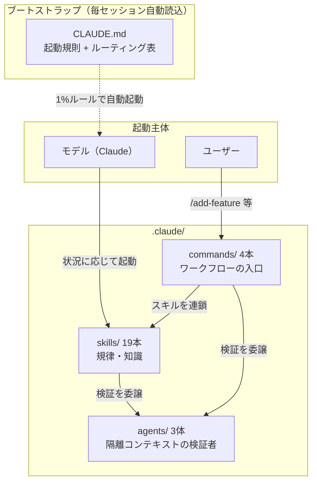
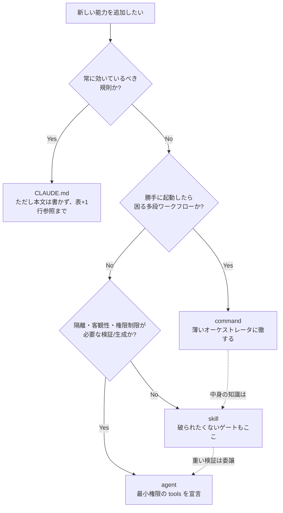
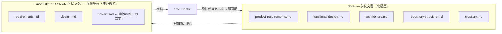
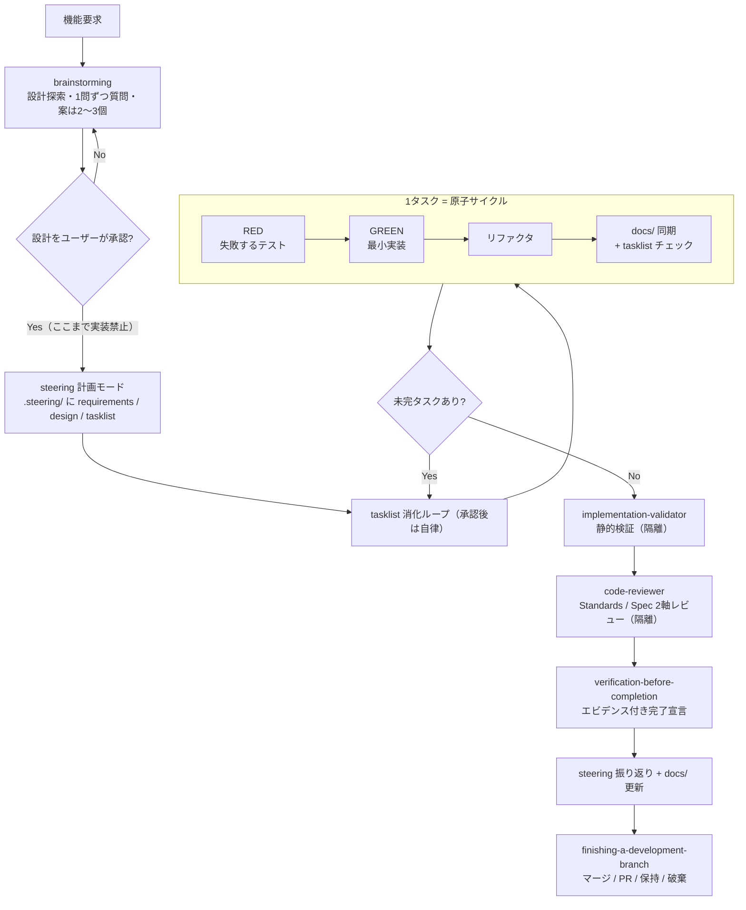

# Claude Code 開発基盤 設計書（標準版）

この文書は、`.claude/` 配下と `CLAUDE.md` からなる AI 支援開発基盤を保守・拡張する技術者に向けて書かれています。同じ内容を江戸落語調で語った版が [claude-infra-design.md](claude-infra-design.md) にあり、利用者向けの簡単な案内は [.claude/README.md](../.claude/README.md) にあります。

## 1. 目的と背景

grep_analyzer の AI 支援開発を、その場しのぎのプロンプトに頼るやり方から、再現できるプロセスに変えることがこの基盤の目的です。そのために、公開されている3つのスキル集を1つに統合しました。

| ソース | 性格 | 統合時の優先順位 |
|---|---|---|
| spec-driven | スペック駆動開発のバンドルです（日本語で書かれており、Kotlin/Android プロジェクト由来です） | 1（最優先） |
| superpowers | 開発規律のスキル集です（英語で、プラグイン形式で配布されています） | 2 |
| mattpocock/skills | 小さく組み合わせやすいスキル集です（英語です） | 3 |

この優先順位は、考え方が衝突したときにどちらを採用するかの基準であり、量の配分ではありません。実際に統合してみると、「骨格は spec-driven、規律は superpowers、補完は skills-main」という役割分担に落ち着きました。個々の衝突をどう裁いたかは [§7](#7-衝突解決の記録) に記録してあります。

統合にあたっての要求は「単純なコピーではなく、このリポジトリで単体で動くスキルにすること」でした。そこで、すべての素材に次の4つの処置を施しています。

1. すべて日本語に書き直しました。
2. Python 3.12 / pytest の環境に合わせて内容を翻案しました。
3. プラグイン機構（フックや名前空間接頭辞）への依存を取り除きました。
4. 既存のプロジェクト規約（coding-conventions / writing-tests）と矛盾しないように調整しました。

## 2. 全体アーキテクチャ

### 2.1 3層構造

基盤は skills・commands・agents の3層でできており、毎セッション自動で読み込まれる `CLAUDE.md` が全体の入口になります。



### 2.2 役割分担の軸

層は「誰が起動するか」と「どのコンテキストで走るか」の2軸で分かれています。どの層にもそれぞれ固有のコストがあり、どのコストを払うのが妥当かで置き場所が決まります。

| 層 | 起動主体 | コンテキスト | 支払うコスト |
|---|---|---|---|
| skills | モデルが自動で起動します | メインの会話に読み込まれます | 読み込むたびに文脈を消費します。そのため「いつ使うか」を示す description の精度が重要です |
| commands | ユーザーが `/` で明示的に起動します | メインの会話に読み込まれます | ユーザーが存在を覚えておく必要があります。そのため数を絞ることが大切です |
| agents | モデルまたは commands が起動します | メインとは隔離された文脈で走ります | 履歴を持たないため、必要な文脈は依頼する側が組み立てて渡す必要があります |

素朴に言えば、「繰り返し使う規律は skill に、手順が長いワークフローの入口は command に、出力が長く客観性が必要な検証は agent に」置くのが基本です（この整理は mattpocock/skills の設計論に基づいています）。ただし、実際の配置判断には次の3つの性質も効いています。

- **強制可能性** — その規則は「起動され損ねたら破られる」ものかどうか、という性質です。破られてはならないゲートを、ユーザーの記憶に頼る command に置くことはできません。
- **暴走リスク** — それが勝手に起動したら困るかどうか、という性質です。何段階も自律で進むワークフローを、自動起動される層に置くことはできません。
- **バイアスと権限** — 自己評価を避けたいか、使えるツールを制限したいか、という性質です。これらを宣言的に強制できるのは agent 層だけです。

### 2.3 配置判断の記録 — 「この役割分担だから、これをこうした」

今回の設計で行った個別の判断とその理由を記録します。将来なにかを追加するときの先例集として使ってください。

| 対象 | 配置 | 判断理由 |
|---|---|---|
| brainstorming（設計先行ゲート） | skill にしました（command にはしませんでした） | ゲートは「ユーザーが `/brainstorm` と打ち忘れたら素通りされる」ものであってはなりません。強制が必要な規則は、モデルが自動起動する skill 層に置きます。つまり、ゲートは入口ではなく規律の側に持たせます |
| /add-feature・/refactor・/setup-project | command にしました（skill にはしませんでした） | 何段階も自律で進むワークフローが「機能追加らしい話題」に反応して勝手に走り出すと危険です。ユーザーの明示的な起動だけが妥当なきっかけです。逆に中身の知識は一切持たせず、skills を順に呼ぶだけの薄い構成にしました（§2.4 の原則2を参照してください） |
| requesting-code-review と code-reviewer | skill と agent に分離しました | 「いつ・何を渡して依頼するか」は繰り返し適用する作法なので skill に置きます。「どう診るか」は観点表と出力形式を含む長いプロンプトで、客観性と読み取り専用の制限も必要なので agent に置きます。当初は skill 側がテンプレートファイルを抱えていましたが、agent 定義との二重管理になるため agent 側に一本化しました |
| doc-reviewer / implementation-validator | agent にしました（skill にはしませんでした） | 自分が書いた成果物を同じ文脈で自分がレビューすると、どうしても自己弁護のバイアスがかかります。また「読み取り専用」「静的検証のみでテスト実行は禁止」という権限の制限は、agent の tools 宣言でしか強制できません |
| writing-plans / executing-plans（superpowers の原典では独立したスキルでした） | steering に吸収しました（独立の skill にはしませんでした） | 計画と実行はひと続きのライフサイクルで、正となる成果物（tasklist.md）も同じです。層を分けると同じ知識が2箇所にたまり、片方だけ更新されて食い違います。正となる帳面は1つに寄せます |
| coding-conventions / writing-tests | skill にしました（CLAUDE.md には入れませんでした） | 常時読み込むには長すぎます（あわせて 250 行を超えます）。必要になるのはコードやテストを書く瞬間だけなので、そのときに読み込まれる skill が適切です。CLAUDE.md には案内を1行だけ置きます（§2.4 の原則5を参照してください） |
| 起動規則・ルーティング表 | CLAUDE.md に置きました（skill にはできませんでした） | 「スキルを引くためのルール」自体を skill にすると、それを引くためのルールが存在しなくなり、自己参照で行き詰まります。これは常に文脈の中にいる必要がある唯一の情報です |
| refactoring | skill と /refactor の両方を用意しました | 9原則の知識は「この関数を直して」というコマンドを通らない普段の会話でも適用されるべきなので skill に置きます。ユーザーが腰を据えてフルフロー（steering の計画から検証まで）を回す入口として command も用意します。知識は skill に、段取りは command に、と分担させれば重複しません |
| grill-me / grill-with-docs | 配置しませんでした（ユーザーレベルに導入済みのためです） | 同じ名前のスキルを二重に置くと、どちらが起動されるかが曖昧になります |

### 2.4 敷衍: どういう設計でいくのがよいか

上の先例から一般化した、配置の判断フローと設計原則です。新しい能力を足すときは、まずこれに通してください。



設計原則を優先度順に挙げます。

1. **ゲートは skill に置きます。** command に置いたゲートは「コマンドを使わなければ」迂回できてしまいます。強制したい規律は自動起動される層に置き、command はそれを呼ぶだけにします。
2. **command は薄く保ちます。** command に知識を書くと、その知識は command を通らない普段の会話では使われなくなります。command の仕事は、スキルと agent を呼ぶ順序の定義だけです。
3. **agent には最小権限だけを与え、状態を持たせません。** レビュアーに編集権限を与えず、静的検証役にテストを実行させません。必要な文脈（SHA の範囲・要求・変更概要）は、依頼する側が組み立てて渡します。
4. **正となる知識は1つにします。** 同じ知識を2つの層に書いてはいけません。書きたくなったら、参照でつなぎます。たとえば TDD の詳細は `test-driven-development` スキルが正であり、steering や command はスキル名で参照するだけにしています。
5. **段階的に開示します。** 文脈は有限の資源です。CLAUDE.md（1行の案内）→ SKILL.md（本文）→ guide/template（詳細）という3段構えにして、読む必要が生じた時点で初めて読み込まれる構造にします。
6. **分割は起動条件で判断し、統合はライフサイクルで判断します。** 起動される状況が違うなら別のスキルに分けます（TDD とデバッグは別の瞬間に必要になります）。同じ仕事の連続する段階なら1つにまとめます（計画と実行を steering に統合したのがこの判断です）。

配置を間違えたときに何が起きるかも、あわせて記録しておきます。

| アンチパターン | 何が起きるか | 正す先 |
|---|---|---|
| 規約やゲートを command に書く | 普段の会話で規約が効かなくなり、ゲートが迂回されます | skill に移します |
| 重い自律ワークフローを skill にする | 話題に反応して意図せず起動し、暴走します | command に移します |
| レビュー観点や検証手順を skill 本文に抱える | メインの文脈を恒久的に占有し、自己レビューのバイアスもかかります | agent に移します |
| CLAUDE.md に本文を詰め込む | 毎セッションの固定費が膨らみ、本当に常時必要な規則が埋もれます | skill に逃がして1行の参照だけ残します |
| 同じ知識を skill と command の両方に書く | 片方だけ更新されて食い違い、どちらが正か分からなくなります | 一方を正とし、他方は参照にします |
| description にスキルの内容を要約して書く | description だけ読まれて、本文がスキップされます | description には「いつ使うか」だけを書きます |

### 2.5 ブートストラップ機構

superpowers の原典は、SessionStart フックという仕組みで `using-superpowers` というスキルを毎セッション注入していました。この基盤はプラグイン機構に依存しないため、同じ役割を `CLAUDE.md` が担います。CLAUDE.md には次の3つが書かれています。

- 起動規則です。該当する可能性が 1% でもあるスキルは、応答より先に起動します。ただし、ディスパッチされたサブエージェントはこの規則の対象外です。
- 状況からスキルへのルーティング表です。
- 鉄則のダイジェストです。詳細は各スキルに任せて、CLAUDE.md 自体は薄く保ちます。

保守上の注意がひとつあります。スキルを追加・改名したら、CLAUDE.md のルーティング表と `.claude/README.md` を必ず同期してください。ルーティング表が古いままだと自動起動が壊れます。mattpocock/skills はこれを「古いルーターは嘘をつく」と呼んでいます。

## 3. 文書の2層モデル

spec-driven から採用した中核の考え方です。すべてのワークフローは、この2層への書き戻しで終わります。



- `docs/` は仕様の正です。各文書作成スキルは「既存の docs/ が自スキルのガイドより優先される」という同一の優先規則を持っています。
- `.steering/` は作業指示ごとに作られ、振り返りまで書いて完結します。進捗の唯一の真実は tasklist.md であり、TodoWrite は揮発性のメモ書きという位置づけに格下げしています。会話が圧縮（コンパクション）されても、ファイルに書かれた帳面は残るからです。
- `docs/superpowers/{specs,plans}/` は旧運用の遺産です。読み取り専用の歴史として保持し、新しい文書は作りません。

## 4. 標準開発フロー

いちばん長い経路は `/add-feature` です。ただし、個々のゲートはコマンドではなくスキル側が持っているため、コマンドを経由しない自然な依頼でも同じゲートを通ります。



補助の経路は次のとおりです。

- バグの報告を受けたときは `systematic-debugging` を使います。まず再現のためのフィードバックループを作り、根本原因を突き止め、再現テストを先に書いてから直します。3回修正して直らなければ、手を止めてアーキテクチャを疑います。
- リファクタリングの依頼は `/refactor` から `refactoring` スキルに入ります。9原則で分析し、上と同じ原子サイクルで進めます。
- 独立したタスクが2件以上あるときは `dispatching-parallel-agents` を使います。同一レスポンス内でまとめて発注することで並列に走ります。

## 5. スキル台帳と出自

どのスキルがどのソースから来たかの一覧です。

| スキル | 主ソース | 混ぜ込み | 主な翻案 |
|---|---|---|---|
| coding-conventions | 既存（本リポジトリ） | — | フラットな .md を `<name>/SKILL.md` 形式へ移行しただけです |
| writing-tests | 既存（本リポジトリ） | — | 同上です |
| steering | spec-driven | superpowers: writing-plans, executing-plans | Gradle を pytest に置き換え、テンプレートのパスを修正しました |
| prd-writing | spec-driven | — | ほぼ原文のままです（元から言語に依存しない内容でした） |
| functional-design | spec-driven | — | Java/JavaFX の例を Python/CLI の例に置き換えました |
| architecture-design | spec-driven | — | 技術選定の例を Python スタックに置き換えました |
| repository-structure | spec-driven | — | `src/main/java` 前提のテンプレートを Python の src レイアウトに全面的に書き換えました |
| glossary-creation | spec-driven | skills-main: domain-modeling | 会話中の随時反映と、コード実態との照合を追加しました |
| refactoring | spec-driven: refactor-kotlin | skills-main: codebase-design | 9原則を Python へ全面的に翻案しました（§5.1 を参照してください） |
| brainstorming | superpowers | skills-main: grilling（1問ずつ聞く作法） | 出力先を .steering/ に変更し、visual-companion（Node 製のモックアップサーバー）は削除しました |
| test-driven-development | superpowers | skills-main: tdd | テストのアンチパターン3種と垂直スライスの考え方を追加しました |
| systematic-debugging | superpowers | skills-main: diagnosing-bugs | フィードバックループの先行構築・仮説のランク付け・DEBUG タグを追加しました |
| verification-before-completion | superpowers | — | 証明に使うコマンドを pytest に固定しました |
| requesting-code-review | superpowers | skills-main: code-review | レビュアーのテンプレートを code-reviewer agent に移しました |
| receiving-code-review | superpowers | — | — |
| dispatching-parallel-agents | superpowers | — | — |
| using-git-worktrees | superpowers | — | ネイティブツールとして EnterWorktree を名指ししました |
| finishing-a-development-branch | superpowers | — | ベースブランチの既定を main にしました |
| writing-skills | superpowers | skills-main: writing-great-skills | この基盤の形式規約を前提として統合しました |

### 5.1 refactoring の翻案対応表（Kotlin → Python）

| 原典の原則 | Python 版 |
|---|---|
| `internal` 可視性 | `_` 接頭辞と `__all__` で表現します。ただし「モジュールをまたいで共有する helper は public 名にする」という既存規約が優先されます |
| `val` / immutable | `@dataclass(frozen=True)`、tuple、`Final` を使います |
| `@JvmInline value class` | `NewType`、小さな dataclass、`StrEnum` を使います |
| インターフェース | `typing.Protocol` を第一候補とし、ABC は共通実装が必要な場合に限ります |
| `./gradlew test / ktlintCheck` | `python -m pytest tests/ -q --tb=line` だけです。リンターはないため、テストが唯一のゲートです |

## 6. agents / commands の設計

### 6.1 agents（3体）

| agent | 出自 | tools | 設計上の制約 |
|---|---|---|---|
| code-reviewer | superpowers のレビュアーテンプレートを agent 化しました | Read, Grep, Glob, Bash | 読み取り専用です。diff は three-dot（BASE...HEAD）を使い、Standards / Spec の2軸を混ぜずに報告します |
| doc-reviewer | spec-driven | Read, Grep, Glob（model: sonnet） | 5軸で評価し、Before/After 付きで指摘します。存在しない文書はスキップして報告します |
| implementation-validator | spec-driven（Kotlin 固有のチェックを Python へ翻案しました） | Read, Grep, Glob, Bash | 静的検証のみで、テスト実行は禁止です。些末な体裁の指摘はしません |

agent に切り出した理由は2つあります。第一に、レビューや検証のプロンプトは観点表や出力形式を含んで長く、メインの会話に置いたままでは文脈を恒久的に占有してしまいます。第二に、自分の書いたコードを同じ文脈で自分がレビューすると自己弁護のバイアスがかかるため、セッション履歴を持たない隔離された文脈で走らせる必要があります。依頼する側（skill / command)は、変更概要・要求・SHA の範囲だけを組み立てて渡します。

### 6.2 commands（4本）と原典からの意図的な変更

| コマンド | 原典からの変更 | 理由 |
|---|---|---|
| /setup-project | development-guidelines を生成するステップを削除しました | 実装規約は既存の coding-conventions / writing-tests が正であり、二重管理を避けるためです |
| /add-feature | 「一切質問しない完全自律」を「設計承認後のみ自律」に変えました | 原典の完全自律は brainstorming の設計承認ゲートと矛盾します。優先順位の規則に従って上位の設計思想を採用し、承認後の自律性だけを残しました |
| /refactor | `Skill('refactor-java')` という参照（原典のバグです）を `refactoring` に修正しました | 原典に壊れた参照が3箇所ありました |
| /review-docs | ほぼ原典どおりです | — |

`refactor-kotlin-all` は移植しませんでした。原典プロジェクト固有のパッケージ一覧がハードコードされており、一般化できないためです。

## 7. 衝突解決の記録

3つの流儀が衝突した論点と、優先順位（spec-driven > superpowers > skills-main）を適用した結果を記録します。

| 論点 | 各ソースの立場 | 採用した結論 |
|---|---|---|
| 進捗管理の正 | spec-driven は tasklist.md、superpowers は TodoWrite と計画文書を正としていました | tasklist.md を唯一の真実とし、TodoWrite は揮発性のメモ書きに格下げしました |
| 計画・設計の置き場 | spec-driven は `.steering/`、superpowers は `docs/superpowers/{specs,plans}/` でした | `.steering/` を採用しました。旧パスは読み取り専用の遺産として残します |
| 自律実行の範囲 | spec-driven の /add-feature は完全無質問、superpowers は設計承認ゲート必須でした | ゲートは設計承認まで、承認後は自律、という両者の合成にしました |
| リファクタリングのタイミング | superpowers は GREEN の後、skills-main の tdd は TDD ループの外としていました | GREEN の後を採用しました（superpowers 優先です） |
| レビューの構造 | superpowers は単一レビュアー、skills-main は Standards・Spec の並列2軸でした | superpowers の手順に skills-main の2軸を内包させました（衝突ではなく合成できると判断しました） |
| 用語集の運用 | spec-driven は文書作成フローの最終成果物、skills-main の domain-modeling は会話中の随時更新でした | spec-driven の構成に、随時更新の規律を追加しました（これも衝突ではないと判断しました） |
| 実装規約の出どころ | spec-driven は development-guidelines 文書を生成し、既存には coding-conventions スキルがありました | 既存スキルを正とし、生成ステップ自体を削除しました |

## 8. スキル記述規約

スキルを新規作成・編集するときは `writing-skills` スキルを起動してください。要点は次の6つです。

1. 形式は `.claude/skills/<name>/SKILL.md` です。フラットな `.md` は読み込まれません。統合前の既存2スキルは、この理由でスキルとして機能していませんでした。
2. frontmatter は `name` と `description` だけにします。description には「いつ使うか」を書き、「何をするか」は書きません。内容を要約すると、description だけ読まれて本文がスキップされる事故が起きます。
3. コード例を除き、すべて日本語で書きます。
4. 他のスキルはプレーン名で参照します（例:「`steering` スキルを使用」）。`superpowers:` のような名前空間接頭辞、強制ロードで文脈を浪費する `@` リンク、リポジトリ外への絶対パスは禁止です。
5. プロジェクト定数として、テストコマンドは `python -m pytest tests/ -q --tb=line`、作業文書の置き場は `.steering/YYYYMMDD-<トピック>/` です。
6. スキルの追加・改名時は、CLAUDE.md のルーティング表・`.claude/README.md`・`settings.local.json` の `Skill(...)` 許可を同期します。

## 9. 整合性チェック（保守手順）

スキル群を変更したら、次の検査を実行してください。統合時に使った検査と同じものです。

```bash
cd .claude
# 1. 禁止残滓（プラグイン接頭辞・他言語スタックの混入）
grep -rniE "superpowers:|gradle|kotlin|ktlint|refactor-java" skills/ commands/ agents/

# 2. frontmatter と name/ディレクトリ名の一致
for f in skills/*/SKILL.md; do
  n=$(grep -m1 '^name:' "$f" | sed 's/name: *//')
  [ "$n" = "$(basename $(dirname $f))" ] || echo "NG: $f"
done

# 3. スキル間参照の実在（`名前` スキル 形式を抽出して突き合わせ）
#    → 未解決参照が出たらスキル改名の同期漏れ
```

## 10. 見送った要素と再導入の指針

すべてを移植したわけではありません。見送ったものと、その理由、再導入するときの指針を記録します。

| 見送ったもの | 理由 | 再導入するなら |
|---|---|---|
| subagent-driven-development（superpowers） | bash スクリプト群（task-brief など）を含む重い基盤です。要点は steering と dispatching-parallel-agents で代替できています | スクリプトを `.claude/skills/<name>/scripts/` に実行権付きで同梱し、進捗台帳 `.superpowers/sdd/` の置き場を決めます |
| to-spec / to-tickets / triage / wayfinder（skills-main） | issue tracker の設定（`docs/agents/issue-tracker.md`）が前提になっています | tracker を決めたあとで、setup 系スキルごと導入します |
| prototype / research / handoff（skills-main） | 自己完結していますが、今のところ必要性が薄いです | 依存がないため、単体で移植できます |
| using-superpowers（superpowers） | SessionStart フックを前提としたブートストラップです | 不要です。CLAUDE.md が同じ役割を担っています（§2.5 を参照してください） |
| grill-me / grill-with-docs（skills-main） | ユーザーレベルに導入済みです（skills-lock.json を参照してください） | 二重には配置しません |

補足がひとつあります。統合元の3フォルダ（spec-driven / superpowers-main / skills-main）はリポジトリから削除済みです。commands と spec-driven 系の agents 2体は、削除前の全数調査で採取した構造仕様から再構成したものであり、原文の逐語的な移植ではありません。原文との差分照合が必要になったら、各配布元から再取得してください。
