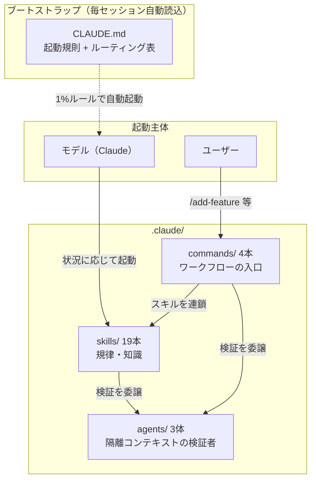
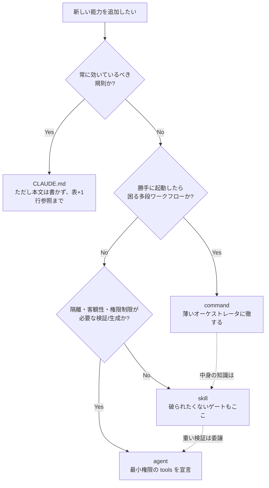
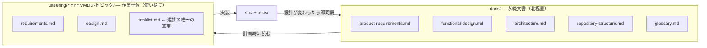
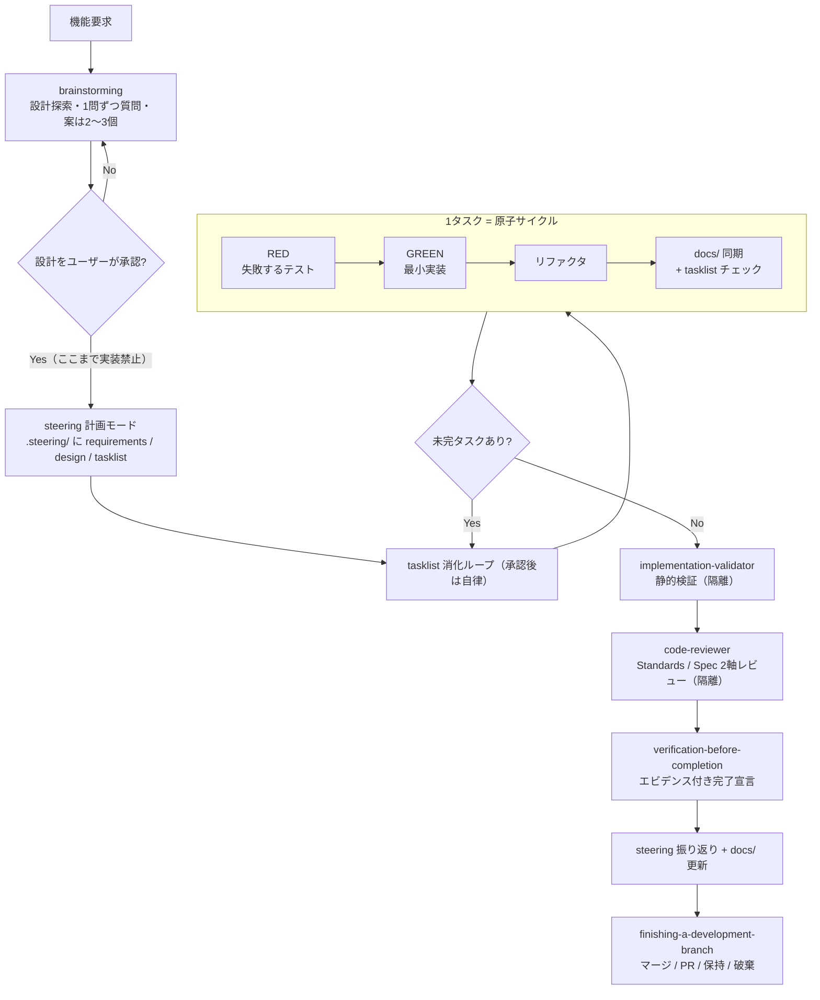

# Claude Code 開発基盤 設計書（らくだ仕立て）

えー、設計書の「らくだ」版でございます。江戸前は [claude-infra-design.md](claude-infra-design.md)、
上方・代書屋は [claude-infra-design-daishoya.md](claude-infra-design-daishoya.md)、
堅気の文は [claude-infra-design-plain.md](claude-infra-design-plain.md)。
噺の前段は [.claude/README-rakuda.md](../.claude/README-rakuda.md) にございまして、
図・表・コマンドはどの版もおんなじ、筋だけが違います。

---

えー、らくだの通夜の翌朝でございます。屑屋の久六、ゆうべの酒がまだ残って、
頭ん中で鐘が鳴っておりますところへ、どんどんどん、と木戸を叩く音。

半次「おう久六! 起きてるかい!」

久六「うう……兄貴、勘弁しておくんなさい。ゆうべのことは、その、酒が」

半次「ゆうべの手前は大したもんだったぜ。commands の表まで書き上げやがった。
——それでな、長屋の若い衆が言うのよ。『帳面はわかった。だが**なんでこういう普請にしたのか、
わけを書いた書付**が欲しい』とな」

久六「わけ、てえと」

半次「**設計書**よ。帳面が『何があるか』なら、設計書は『なぜそうしたか』だ。
保守する者が迷わねえように、裁きの記録ごと残す。——書きな」

久六「へい……(この兄貴、断ると死人が踊るからなあ)……筆、持ちました」

## 1. 目的と背景

半次「まず経緯だ。らくだ——規律なしの AI 運用を弔って、その場しのぎの口伝(プロンプト)から
**再現できるプロセス**へ建て替えた。元手はゆうべの香典、三軒ぶんよ」

| ソース | 性格 | 統合時の優先順位 |
|---|---|---|
| spec-driven | スペック駆動開発バンドル（日本語、Kotlin/Android 由来） | **1（本家）** |
| superpowers | 開発規律スキル集（英語、プラグイン形式） | 2（分家） |
| mattpocock/skills | 小さく合成可能なスキル集（英語） | 3（出入り） |

久六「兄貴、この順位てえのは、包みの厚さで?」

半次「いい問いだ。**厚さじゃねえ、喧嘩の裁きの順**よ。流儀同士が言い分をぶつけたとき、
どっちの言い分を通すかの順番だ。量の配分じゃあねえ。
蓋を開けりゃ『**骨格は本家 spec-driven、職人の性根は分家 superpowers、
小技は出入りの skills-main**』てえ塩梅に収まった。裁きの記録は [§7](#7-衝突解決の記録) だ」

久六「へい。ほんで注文は」

半次「ひとつきり。『丸写しはならねえ、**この長屋で単体で動く**仕込みにしろ』。
だから素材にゃ残らず手を入れた。書いとけ——」

1. すべて日本語に書き直した
2. Python 3.12 / pytest の環境に合わせて翻案した
3. プラグイン機構（フックや名前空間接頭辞）への依存を取り除いた
4. 既存の家訓（coding-conventions / writing-tests）と矛盾しねえよう調整した

久六「(二日酔いにゃ、この兄貴の声がいちいち響くんだ……)」

## 2. 全体アーキテクチャ

### 2.1 3層構造

半次「間取りはゆうべの帳面のとおり、**心得（skills）・注文口（commands）・検査役（agents）**の三間。
壁の掟書き（CLAUDE.md）が毎朝読み上げる。図に起こしな」



### 2.2 役割分担の軸

半次「層の分け方は『**誰が起動するか**』と『**どのコンテキストで走るか**』の二軸。
どの層もタダ飯は食ってねえ、それぞれ払いがある。**どの払いが安く済むかで置き場所を決める**」

| 層 | 起動主体 | コンテキスト | 支払うコスト | 例 |
|---|---|---|---|---|
| skills | モデル（自動） | メイン会話に読み込む | 文脈消費（読み込むたび）→ description の精度が命 | `test-driven-development` |
| commands | ユーザー（`/` 明示） | メイン会話に読み込む | ユーザーの認知負荷（存在を覚える必要）→ 数を絞る | `/add-feature` |
| agents | モデル or commands | **隔離**（メイン文脈を汚さない） | 文脈の再構成コスト（履歴を持たないため依頼側が渡す） | `code-reviewer` |

半次「素朴にゃ『繰り返し使う規律 → skill、手順の長い仕事の入口 → command、
出力が長くて目の曇っちゃならねえ検分 → agent』（mattpocock/skills の設計論だ）。
だが実際の裁きにゃ、あと三つの性質が効く」

- **強制可能性** — その決まりは「起動され損ねたら破られる」代物か。破られてならねえ関所を、
  ユーザーの覚えなんてえ頼りねえもんに任せる法はねえ。command には置けねえ
- **暴走リスク** — そいつが勝手に動き出したら困るか。多段の自律仕事を自動起動の層に置いたら、
  らくだの生き返りだ
- **バイアスと権限** — 手前の仕事に手前で判をつく目利きは信用ならねえ。目を離す、刃物を取り上げる。
  それを宣言で強制できるのは agent 層だけだ

久六「……兄貴。二日酔いの頭で聞いても、三つ目だけは腹に落ちまさあ。
らくだの『**できやした**』を、あっしらは何べん信じたことか」

半次「そういうことよ」

### 2.3 配置判断の記録 — 「この役割分担だから、これをこうした」

半次「ここが書付の眼目だ。**なぜそこに置いたか**。これを残さねえと、
次に増やす野郎がまた鼻息で置く。——おう、ゆうべの手前みてえにな」

久六「あれは酒で! ……へい、先例集、書きます」

| 対象 | 配置 | 判断理由 |
|---|---|---|
| brainstorming（設計先行ゲート） | **skill**（command にしない） | 関所ってのは「ユーザーが `/brainstorm` と打ち忘れたら素通り」じゃ話にならねえ。強制の要る決まりはモデルが自動で起動する skill 層へ。**関所は木戸じゃなく職人の性根に彫り込む** |
| /add-feature・/refactor・/setup-project | **command**（skill にしない） | 多段の自律仕事が「機能っぽい話題」に釣られて勝手に走り出したら、らくだの再来だ。ユーザーの明示の注文だけが妥当な引き金。逆に中身の知識は一切持たせず、skills を連ねるだけの薄い番頭に徹させた（§2.4 原則2） |
| requesting-code-review と code-reviewer | **skill + agent に分離** | 「いつ・何を持たせて頼むか」は繰り返しの作法 → skill。「どう診るか」（観点表・出力形式の長口上）+ 曇らねえ目 + 読み取り専用の縛り → agent。当初は skill が口上書きを抱えてたが、agent 定義との二重帳簿なんぞ願い下げだ、agent 側へ一本化 |
| doc-reviewer / implementation-validator | **agent**（skill にしない） | 手前の書いた物を同じ座敷で手前が検分してみろ、身贔屓が出るに決まってら。それに「読むだけ」「静的検証のみ・テスト実行禁止」てえ刃物の取り上げは、agent の tools 宣言でしか強制できねえ |
| writing-plans / executing-plans（superpowers 原典では独立スキル） | **steering に吸収**（独立 skill にしない） | 計画→実行はひと続きの仕事、正となる帳面（tasklist.md）も同じ。層を分けりゃ同じ知識が二箇所に積もって、片方だけ直されて食い違う。**帳面の正はひとつに寄せろ** |
| coding-conventions / writing-tests | **skill**（CLAUDE.md に入れない） | 壁の掟書きに貼るにゃ長すぎらぁ（計 250 行超）。要るのはコード・テストを書くその瞬間だけ → 遅延ロード。掟書きにゃ案内の一行だけ（§2.4 原則5） |
| 起動規則・ルーティング表 | **CLAUDE.md**（skill にしない） | 「スキルを引くための決まり」自体を skill にしてみろ、そいつを引く決まりが無えじゃねえか（自己参照で詰む）。常に座敷に居なきゃならねえ唯一の情報だ |
| refactoring | **skill と /refactor の両方** | 9原則の知識は「この関数直して」てえ注文口を通らねえ会話でも効かなきゃ嘘だ → skill。旦那が腰を据えてフルコース（steering 計画〜検証込み）を頼む入口 → command。**知識は skill、段取りは command** と分けりゃ重複しねえ |
| grill-me / grill-with-docs | **配置しない**（ユーザーレベル導入済み） | 同じ名の職人を二人並べてみろ、どっちが出てくるか分かりゃしねえ |

久六「兄貴、ひとつ聞いていいですかい。brainstorming の関所、なんで木戸(command)じゃ
いけねえんで? 木戸のほうが目に立つでしょうに」

半次「目に立つ木戸は**避けて通れる**んだよ。裏道を行きゃあいい。
性根に彫り込んだ関所は、どの道を通っても付いてくる。——いい問いだ。二日酔いのほうが冴えるな」

### 2.4 敷衍: どういう設計でいくのがよいか

半次「先例だけじゃ足りねえ。次に増やす奴のために、見立ての図と原則を残す」



**設計原則（優先度順）**

1. **関所（ゲート）は skill に置け** — command に置いた関所なんざ「コマンドを使わなけりゃ」
   素通りできる木戸だ。強制してえ規律は自動起動の層に置いて、command はそれを呼ぶだけにしろ
2. **command は薄く保て** — command に知識を書き込んでみろ、その知識は command を通らねえ
   普段の会話で蔵入り（死蔵）だ。command の仕事は skill と agent を連ねる順序の定義、それっきり
3. **agent は最小権限 + ステートレス** — 検分役に鑿を持たせるやつがあるか。検証役にテストを
   走らせるんじゃねえ。要る文脈（SHA 範囲・要求・変更概要）は頼む側が膳立てして渡せ
4. **帳面の正はひとつ** — 同じ知識を二層に書くんじゃねえ。書きたくなったら参照で繋げ
   （例: TDD の細目は `test-driven-development` が正、steering や command は名で呼ぶだけ）
5. **漸進的開示** — 文脈てえ座敷は広かねえんだ。CLAUDE.md（1行）→ SKILL.md（本文）→
   guide/template（詳細）の三段構えで、読む用が生じたその時に初めて上がり込ませろ
6. **分割は起動条件で、統合はライフサイクルで** — 出番の状況が違うなら別スキルに分けろ
   （TDD とデバッグは別の瞬間に要る）。同じ仕事のひと続きなら一本にまとめろ
   （計画と実行を steering に統合した裁きがそれよ）

久六「置き間違えたら、どうなるんで」

半次「**らくだが踊る**。……冗談じゃねえぜ、祟りの型まで書いとくんだ」

| アンチパターン | 何が起きるか | 正す先 |
|---|---|---|
| 規約・ゲートを command に書く | 普段の会話で規約が効かねえ。関所が素通りされる | skill へ |
| 重い自律ワークフローを skill にする | 話題に釣られて勝手に発火、暴れ出す | command へ |
| レビュー観点・検証手順を skill 本文に抱える | 座敷（メイン文脈）に居座られた挙句、身贔屓レビュー | agent へ |
| CLAUDE.md に本文を詰め込む | 毎朝の読み上げが長くなって、肝心の掟が埋もれる | skill へ逃がし1行参照 |
| 同じ知識を skill と command の両方に書く | 片方だけ直されて食い違い、どっちが正か分かりゃしねえ | 一方を正にし他方は参照 |
| description にスキルの内容を要約する | 看板だけ読まれて中身が素通りされる | description は「いつ使うか」だけ |

### 2.5 ブートストラップ機構

半次「分家 superpowers の原典はな、SessionStart フックてえからくりで、
毎セッション `using-superpowers` を注入してた。うちはプラグイン機構に頼らねえ建付けだから、
**同じ役目は掟書き `CLAUDE.md` が務める**」

- 起動規則（該当の見込みが 1% でもあるスキルは、返事より先に起動 / サブエージェントは対象外）
- 状況 → スキルのルーティング表
- 鉄則ダイジェスト（細目は各スキルに任せ、掟書き自体は薄く保つ）

> **保守の心得**: スキルを増やしたり名を改めたりしたら、CLAUDE.md のルーティング表と
> `.claude/README.md` を必ず揃えろ。案内板が古けりゃ自動起動が壊れる
> （mattpocock/skills の言い草じゃ「**古いルーターは嘘をつく**」——嘘つきの案内板を信じて
> 歩くと、着く先はらくだの家だぜ）。

## 3. 文書の2層モデル

半次「文書は二層。本家 spec-driven から頂いた眼目の考えで、
どの仕事も仕舞いにゃこの二層への書き戻しで手仕舞いになる」



半次「`docs/` は仕様の正、家訓と普請図面だ。文書作成スキルはどれも
『既存の docs/ が自スキルのガイドより優先』てえ同じ優先規則を持ってる。
`.steering/` は注文ごとに建てる普請場の小屋で、振り返りまで書いて畳む。
**tasklist.md が進捗の唯一の真実**、TodoWrite は揮発のメモ書きに格下げだ」

久六「格下げの理由は」

半次「会話が圧縮(コンパクション)されりゃメモは飛ぶ。だが**紙の帳面は残る**。
らくだの『やった気がしやす』を二度と聞かねえための仕掛けよ。
——ああそれと、`docs/superpowers/{specs,plans}/` は先代の蔵だ。読むのは勝手、
新しく納めるのは無しだ。ゆうべ火屋に運んだのは**旧配置の残骸**であって、蔵は焼いてねえぜ」

久六「へい、あやうく蔵ごと樽に詰めるとこでした」

## 4. 標準開発フロー

半次「仕事の本線だ。いちばん長えのは `/add-feature`。だが個々の関所は command じゃなく
skill が握ってるから、**注文口を通らねえ普段の頼まれ事でも同じ関所を通る**。ここが利いてる」



脇道は三本だ。

- **バグの訴え** → `systematic-debugging`（まず再現の仕掛けをこせえて、根本原因を突き止め、
  再現テストを先に書いてから直す。当てずっぽうの継ぎ当ては、らくだの十八番だったろう。
  三度直して直らなけりゃ手を止めて普請の骨組みを疑え）
- **リファクタの注文** → `/refactor` → `refactoring`（9原則で診立てて、上と同じ原子サイクル）
- **独立仕事の束** → `dispatching-parallel-agents`（同一レスポンス内で一斉に発注 = 並列。
  小出しにしたら並ばねえ）

## 5. スキル台帳と出自

半次「香典帳の清書だ。どの品がどこから来たか、出所を残らず書く。
出所の知れねえ品を置くと、あとで誰も手入れできなくなる」

| スキル | 主ソース | 混ぜ込み | 主な翻案 |
|---|---|---|---|
| coding-conventions | 既存（本リポジトリ） | — | フラット .md → `<name>/SKILL.md` へ移行のみ |
| writing-tests | 既存（本リポジトリ） | — | 同上 |
| steering | spec-driven | superpowers: writing-plans, executing-plans | Gradle→pytest、テンプレパス修正 |
| prd-writing | spec-driven | — | ほぼ原文（元から言語非依存） |
| functional-design | spec-driven | — | Java/JavaFX 例 → Python/CLI 例 |
| architecture-design | spec-driven | — | 技術選定例を Python スタックへ |
| repository-structure | spec-driven | — | `src/main/java` → Python src レイアウトへ全面書換 |
| glossary-creation | spec-driven | skills-main: domain-modeling | 随時反映・コード実態との照合を追加 |
| refactoring | spec-driven: refactor-kotlin | skills-main: codebase-design | 9原則を Python へ全面翻案（§5.1） |
| brainstorming | superpowers | skills-main: grilling（1問ずつ） | 出力先を .steering/ へ、visual-companion 削除 |
| test-driven-development | superpowers | skills-main: tdd | アンチパターン3種・垂直スライスを追加 |
| systematic-debugging | superpowers | skills-main: diagnosing-bugs | フィードバックループ先行・仮説ランク付け・DEBUG タグ |
| verification-before-completion | superpowers | — | 証明コマンドを pytest に固定 |
| requesting-code-review | superpowers | skills-main: code-review | テンプレを code-reviewer agent へ移管 |
| receiving-code-review | superpowers | — | — |
| dispatching-parallel-agents | superpowers | — | — |
| using-git-worktrees | superpowers | — | ネイティブツールを EnterWorktree と名指し |
| finishing-a-development-branch | superpowers | — | ベースブランチ main を既定に |
| writing-skills | superpowers | skills-main: writing-great-skills | 本基盤の形式規約を前提に統合 |

### 5.1 refactoring の翻案対応表（Kotlin → Python）

半次「本家のリファクタ心得は Kotlin てえ、よその言葉で書いてあった。
大工道具を鑿鉋ごと持ち替えた対応表だ」

| 原典の原則 | Python 版 |
|---|---|
| `internal` 可視性 | `_` 接頭辞 + `__all__`（ただし「モジュール跨ぎ共有 helper は public 名」の家訓が優先） |
| `val` / immutable | `@dataclass(frozen=True)`、tuple、`Final` |
| `@JvmInline value class` | `NewType` / 小さな dataclass / `StrEnum` |
| インターフェース | `typing.Protocol` 第一候補、ABC は共通実装が要る場合のみ |
| `./gradlew test / ktlintCheck` | `python -m pytest tests/ -q --tb=line`（リンタ無し。テストが唯一の関所） |

## 6. agents / commands の設計

### 6.1 agents（3体）

| agent | 出自 | tools | 設計上の制約 |
|---|---|---|---|
| code-reviewer | superpowers のレビュアーテンプレを agent 化 | Read, Grep, Glob, Bash | 読み取り専用。BASE...HEAD の three-dot diff。Standards / Spec の2軸を混ぜない |
| doc-reviewer | spec-driven | Read, Grep, Glob（model: sonnet） | 5軸評価 + Before/After 付き指摘。存在しない文書はスキップ報告 |
| implementation-validator | spec-driven（Kotlin チェックを Python へ翻案） | Read, Grep, Glob, Bash | 静的検証のみ・テスト実行禁止。cosmetics を指摘しない |

半次「離れに出した理屈は二つ。検分の口上（観点表・出力形式）は長え——座敷に置きっぱなしじゃ
場所塞ぎだ。それと、手前の書いた物を手前で検分すりゃ身贔屓が出る。
だから**履歴を持たねえ離れ座敷**で診させて、頼む側は変更概要・要求・SHA の範囲だけ膳に載せる。
らくだの『できやした』の轍は二度と踏まねえ」

### 6.2 commands（4本）と原典からの意図的な変更

| コマンド | 原典からの変更 | 理由 |
|---|---|---|
| /setup-project | development-guidelines 生成ステップを削除 | 実装規約は既存の coding-conventions / writing-tests が正。二重帳簿なんぞ願い下げ |
| /add-feature | 「一切質問しない完全自律」→「**設計承認後**のみ自律」 | 原典の完全自律は brainstorming の関所と真っ向勝負。優先順位の裁きで上位の設計思想を採り、承認後の自律だけ残した |
| /refactor | `Skill('refactor-java')` 参照（原典のバグ）を `refactoring` へ修正 | 原典に壊れた参照が3箇所。よそ様の仕事にも言うべきことは言う |
| /review-docs | ほぼ原典どおり | — |

半次「移さなかったのは `refactor-kotlin-all`。原典の長屋のパッケージ一覧が名指しで
書き込んであって、持ち出しようがねえ。ありゃ売りもんじゃねえ、備え付けだ」

## 7. 衝突解決の記録

半次「さて、香典を集めた三軒が、それぞれ言い分を持ってた。七度揉めて、七度裁いた。
その記録だ。優先順位は spec-driven > superpowers > skills-main——喧嘩両成敗たぁいかねえ」

久六「兄貴が裁いたんで?」

半次「順位が裁いたのよ。俺の裁量じゃねえ、**基準に裁かせる**。これが肝だ。
裁量で裁つと、次の喧嘩でまた俺が要る。基準で裁ちゃ、俺がいなくても裁ける」

| 論点 | 各ソースの立場 | 採用 |
|---|---|---|
| 進捗管理の正 | spec-driven: tasklist.md / superpowers: TodoWrite + 計画文書 | **tasklist.md が唯一の真実**、TodoWrite は揮発スクラッチパッド |
| 計画・設計の置き場 | spec-driven: `.steering/` / superpowers: `docs/superpowers/{specs,plans}/` | **`.steering/`**。旧パスは読み取り専用の蔵 |
| 自律実行の範囲 | spec-driven /add-feature: 完全無質問 / superpowers: 設計承認ゲート必須 | 関所は**設計承認まで**、承認後は自律（両者の合わせ技） |
| リファクタのタイミング | superpowers: GREEN の後 / skills-main tdd: TDD ループの外 | **GREEN の後**（superpowers 優先） |
| レビューの構造 | superpowers: 単一レビュアー / skills-main: Standards・Spec の並列2軸 | superpowers の手順に skills-main の**2軸を内包**（喧嘩に非ずと見て合成） |
| 用語集の運用 | spec-driven: 文書作成フローの最終成果物 / skills-main domain-modeling: 会話中に随時更新 | spec-driven の構成 + **随時更新の規律を追加**（喧嘩に非ず） |
| 実装規約の出どころ | spec-driven: development-guidelines 文書を生成 / 既存: coding-conventions スキル | **既存スキルが正**。生成ステップ自体を削除 |

## 8. スキル記述規約

半次「新しく拵える・手を入れるときの心得は六つ。`writing-skills` スキルを起動してからだ」

1. 形式は `.claude/skills/<name>/SKILL.md`。フラットな `.md` は**読み込まれねえ**
   （らくだの死因を忘れるな。看板出して中身は留守、あれで当たったんだ）
2. frontmatter は `name` / `description` のみ。description は「**いつ使うか**」であって
   「何をするか」じゃねえ（内容を要約してみろ、看板だけ読まれて中身が素通りされる事故が起きる）
3. 全て日本語だ（コード例は除く）
4. 他スキルはプレーン名で参照（`` `steering` スキル``）。`superpowers:` みてえな名前空間接頭辞、
   `@` リンク（強制ロードで座敷を食い潰す）、リポジトリ外への絶対パスは御法度
5. プロジェクト定数: テストコマンドは `python -m pytest tests/ -q --tb=line`、
   作業文書は `.steering/YYYYMMDD-<トピック>/`
6. スキルの追加・改名時は CLAUDE.md ルーティング表・`.claude/README.md`・
   `settings.local.json` の `Skill(...)` 許可を揃える。片手落ちは無しだ

## 9. 整合性チェック（保守手順）

半次「スキル群に手を入れたら、この検分を通せ。統合んときに使った検査と同じもんだ」

久六「兄貴、あっしぁこの、みみずののたくったような字が読めねえんで……」

半次「読めなくていい、**そのまま流せば動く**。シェルてえのはそういうもんだ」

```bash
cd .claude
# 1. 禁止残滓（プラグイン接頭辞・他言語スタックの混入）
grep -rniE "superpowers:|gradle|kotlin|ktlint|refactor-java" skills/ commands/ agents/

# 2. frontmatter と name/ディレクトリ名の一致
for f in skills/*/SKILL.md; do
  n=$(grep -m1 '^name:' "$f" | sed 's/name: *//')
  [ "$n" = "$(basename $(dirname $f))" ] || echo "NG: $f"
done

# 3. スキル間参照の実在（`名前` スキル 形式を抽出して突き合わせ）
#    → 未解決参照が出たらスキル改名の同期漏れ
```

## 10. 見送った要素と再導入の指針

久六「兄貴、香典、まだ全部は使ってねえんでしょう」

半次「おう。長屋に入り切らねえ道具まで担ぎ込むのは、働き者じゃなくてただの馬鹿力だ。
**蔵の場所だけ帳面につけとく**——入用んときに取りに行きゃあいい」

| 見送り | 理由 | 再導入するなら |
|---|---|---|
| subagent-driven-development（superpowers） | bash スクリプト群（task-brief 等）込みの重い基盤。要点は steering + dispatching-parallel-agents で代替 | スクリプトを `.claude/skills/<name>/scripts/` に実行権付きで同梱し、進捗台帳 `.superpowers/sdd/` の置き場を決める |
| to-spec / to-tickets / triage / wayfinder（skills-main） | issue tracker 設定（`docs/agents/issue-tracker.md`）が前提 | tracker 決定後、setup 系スキルごと導入 |
| prototype / research / handoff（skills-main） | 自己完結だが今のところ入用でない | 単体で移植可能（依存なし） |
| using-superpowers（superpowers） | SessionStart フック前提のブートストラップ | 不要。CLAUDE.md が同役割（§2.5） |
| grill-me / grill-with-docs（skills-main） | ユーザーレベルに導入済み（skills-lock.json） | 二重配置しない |

> **注**: 統合元の3フォルダ（spec-driven / superpowers-main / skills-main）は片付け済み。
> commands と spec-driven 系 agents 2体は、片付け前の全数調査で採った構造仕様からの再構成で、
> 一字一句の写しじゃねえ。原文と突き合わせたくなったら、各配布元から改めて仕入れな。

---

半次「……よし、書付はこれで上がりだ。久六、ようやった。祝いに一杯——」

久六「兄貴、待っておくんなさい」

半次「なんでえ、遠慮するな」

久六「掟書きにありましたろう。**新鮮な検証エビデンスなしに『できやした』と言うんじゃねえ**。
まず検分だ。(と、§9 の検査をそのまま流す)……禁止残滓なし、frontmatter よし、参照よし。
——**緑**だ。へへ、これで胸を張って言えまさあ。書付、できやした!」

半次「言うようになったじゃねえか。ほれ、盃だ」

久六「へい。……**冷やでいいから、もう一杯**」

お後がよろしいようで。
