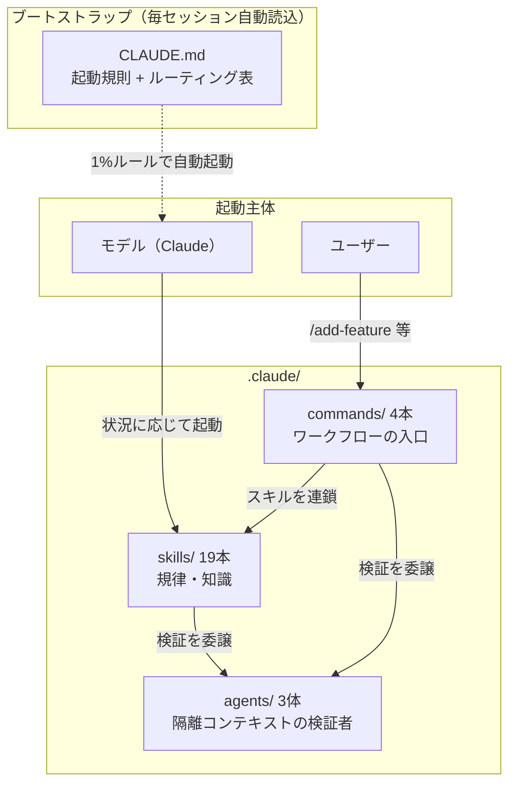
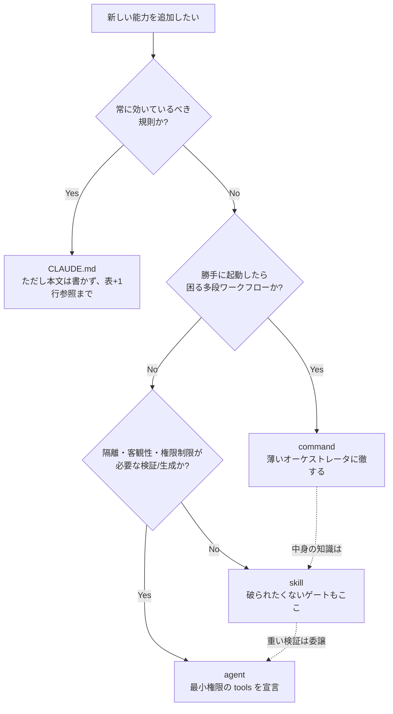
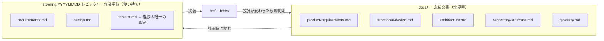
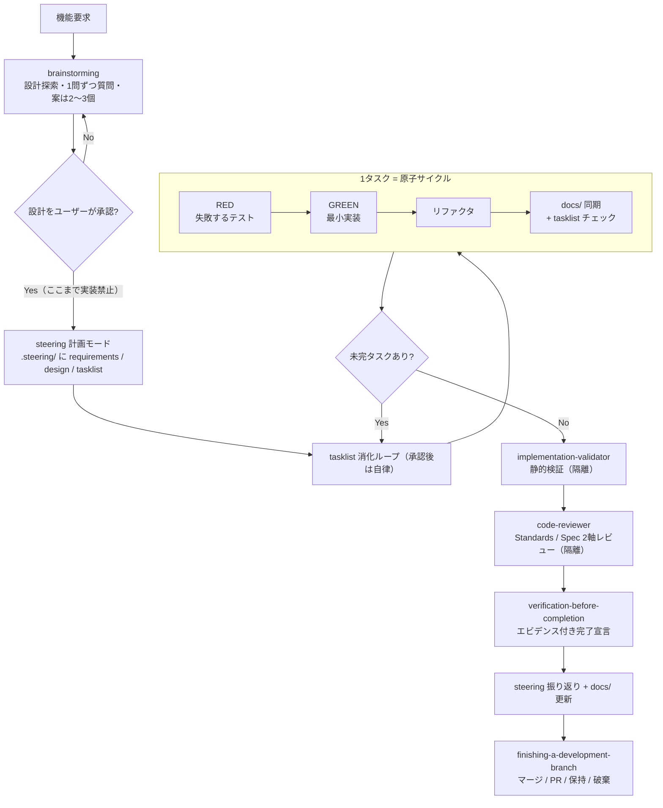

# Claude Code 開発基盤 設計書

対象読者: この開発基盤（`.claude/` 配下と `CLAUDE.md`）を保守・拡張する技術者。
利用者向けの案内は [.claude/README.md](../.claude/README.md) を参照。

## 1. 目的と背景

grep_analyzer の AI 支援開発を「その場しのぎのプロンプト」から「再現可能なプロセス」にするため、
公開されている3つのスキル集を単一の自己完結した基盤へ統合した。

| ソース | 性格 | 統合時の優先順位 |
|---|---|---|
| spec-driven | スペック駆動開発バンドル（日本語、Kotlin/Android 由来） | **1（最優先）** |
| superpowers | 開発規律スキル集（英語、プラグイン形式） | 2 |
| mattpocock/skills | 小さく合成可能なスキル集（英語） | 3 |

優先順位は**考え方が衝突したときの採用基準**であり、量の配分ではない。
実際の統合結果は「**骨格 = spec-driven、規律 = superpowers、補完 = skills-main**」という役割分担になった
（衝突の個別記録は [§7](#7-衝突解決の記録)）。

統合にあたっての要求は「単純コピーではなく、このリポジトリで単体動作するスキルにする」こと。
そのため全素材について (1) 日本語化、(2) Python 3.12 / pytest への翻案、(3) プラグイン機構への依存除去、
(4) 既存プロジェクト規約（coding-conventions / writing-tests）との矛盾解消、を実施している。

## 2. 全体アーキテクチャ

### 2.1 3層構造



### 2.2 役割分担の軸

層の分割基準は「**誰が起動するか × どのコンテキストで走るか**」の2軸。
それぞれの層は異なるコストを支払っており、**どのコストを払うのが妥当かで配置が決まる**。

| 層 | 起動主体 | コンテキスト | 支払うコスト | 例 |
|---|---|---|---|---|
| skills | モデル（自動） | メイン会話に読み込む | 文脈消費（読み込むたび）→ description の精度が命 | `test-driven-development` |
| commands | ユーザー（`/` 明示） | メイン会話に読み込む | ユーザーの認知負荷（存在を覚える必要）→ 数を絞る | `/add-feature` |
| agents | モデル or commands | **隔離**（メイン文脈を汚さない） | 文脈の再構成コスト（履歴を持たないため依頼側が渡す） | `code-reviewer` |

この2軸から導かれる素朴な判定は「繰り返し使う規律 → skill、手順が長いワークフローの入口 → command、
出力が長大・客観性が必要な検証 → agent」（mattpocock/skills の設計論に基づく）。
ただし実際の配置判断には、これに加えて次の3つの性質が効いた:

- **強制可能性** — その規則は「起動され損ねたら破られる」か。破られてはならないゲートは、
  ユーザーの記憶に依存する command には置けない
- **暴走リスク** — それが勝手に起動したら困るか。多段の自律ワークフローは自動起動層に置けない
- **バイアスと権限** — 自己評価を避けたいか、ツールを制限したいか。これを宣言的に強制できるのは agent 層だけ

### 2.3 配置判断の記録 — 「この役割分担だから、これをこうした」

今回の設計で行った個別判断とその理由。将来の配置判断の先例集として使う。

| 対象 | 配置 | 判断理由 |
|---|---|---|
| brainstorming（設計先行ゲート） | **skill**（command にしない） | ゲートは「ユーザーが `/brainstorm` を打ち忘れたら破られる」ものであってはならない。強制可能性が必要な規則は、モデルが自動起動する skill 層に置く。**ゲートは入口ではなく規律側に持たせる** |
| /add-feature・/refactor・/setup-project | **command**（skill にしない） | 多段の自律ワークフローが「機能っぽい話題」に反応して勝手に走り出したら暴走。ユーザーの明示起動だけが妥当なトリガー。逆に中身の知識は一切持たせず、skills を連鎖するだけの薄いオーケストレータにした（§2.4 原則2） |
| requesting-code-review と code-reviewer | **skill + agent に分離** | 「いつ・何を渡して依頼するか」は繰り返し適用する規律 → skill。「どう診るか」（観点表・出力形式の長大プロンプト）+ 客観性 + 読み取り専用制限 → agent。当初は skill 内テンプレファイルだったが、agent 定義と二重管理になるため agent 側へ一本化した |
| doc-reviewer / implementation-validator | **agent**（skill にしない） | 自分が書いた成果物を同じ文脈で自分がレビューすると自己弁護バイアスがかかる。また「読み取り専用」「静的検証のみ・テスト実行禁止」という権限制限は agent の tools 宣言でのみ強制できる |
| writing-plans / executing-plans（superpowers 原典では独立スキル） | **steering に吸収**（独立 skill にしない） | 計画→実行は同一ライフサイクルで、正となる成果物（tasklist.md）も同一。層を分けると同じ知識が2箇所に堆積し、片方だけ更新されて乖離する。**単一の正に規律を寄せる** |
| coding-conventions / writing-tests | **skill**（CLAUDE.md に入れない） | 常時ロードには重すぎる（計 250 行超）。必要なのはコード/テストを書く瞬間だけ → 遅延ロード。CLAUDE.md にはルーティング1行のみ置く（§2.4 原則5） |
| 起動規則・ルーティング表 | **CLAUDE.md**（skill にしない） | 「スキルを引くためのルール」自体が skill だと、それを引くルールが無い（自己参照で詰む）。常時文脈に居る必要がある唯一の情報 |
| refactoring | **skill と /refactor の両方** | 9原則の知識は「この関数直して」という command を通らない会話でも適用されるべき → skill。ユーザーが明示的にフルフロー（steering 計画〜検証込み）を回す入口 → command。**知識は skill、編成は command** と分担させれば重複しない |
| grill-me / grill-with-docs | **配置しない**（ユーザーレベル導入済み） | 同名スキルの二重配置は起動解決を曖昧にする |

### 2.4 敷衍: どういう設計でいくのがベストか

上の先例から一般化した配置の判断フローと設計原則。新しい能力を足すときはまずこれに通す。



**設計原則（優先度順）**

1. **ゲートは skill に置く** — command に置いたゲートは「コマンドを使わなければ」迂回できる。
   強制したい規律は自動起動層に置き、command はそれを呼ぶだけにする
2. **command は薄く保つ** — command に知識を書くと、その知識は command を通らない普通の会話で
   死蔵される。command の仕事はスキルと agent の連鎖順序の定義だけ
3. **agent は最小権限 + ステートレス** — レビュアーに編集権限を与えない。検証者にテスト実行させない。
   必要な文脈（SHA 範囲・要求・変更概要）は依頼側が明示的に構成して渡す
4. **単一の正** — 同じ知識を2層に書かない。書きたくなったら参照で繋ぐ
   （例: TDD の詳細は `test-driven-development` が正で、steering や command はスキル名で参照するだけ）
5. **漸進的開示** — 文脈は有限資源。CLAUDE.md（1行）→ SKILL.md（本文）→ guide/template（詳細）の
   3段で、読む必要が生じた時点で初めてロードされる構造にする
6. **分割は起動条件で、統合はライフサイクルで** — 起動される状況が違うなら別スキルに分割
   （TDD とデバッグは別の瞬間に要る）。同じ作業の連続する段階なら1スキルに統合
   （計画と実行を steering に統合した判断）

**配置ミスの故障モード**

| アンチパターン | 何が起きるか | 正す先 |
|---|---|---|
| 規約・ゲートを command に書く | 通常会話で規約が効かない。ゲートが迂回される | skill へ |
| 重い自律ワークフローを skill にする | 話題に反応して意図せず発火し、暴走する | command へ |
| レビュー観点・検証手順を skill 本文に抱える | メイン文脈を恒久占有 + 自己レビューバイアス | agent へ |
| CLAUDE.md に本文を詰め込む | 毎セッションの固定費が膨らみ、本当に常時必要な規則が埋もれる | skill へ逃がし1行参照 |
| 同じ知識を skill と command の両方に書く | 片方だけ更新されて乖離。どちらが正か不明になる | 一方を正にし他方は参照 |
| description にスキルの内容を要約する | description だけ読まれて本文がスキップされる | description は「いつ使うか」だけ |

### 2.5 ブートストラップ機構

superpowers 原典は SessionStart フックで `using-superpowers` スキルを毎セッション注入していた。
本基盤ではプラグイン機構に依存しないため、**同じ役割を `CLAUDE.md` が担う**:

- 起動規則（該当可能性 1% でもスキルを応答より先に起動 / サブエージェントは対象外）
- 状況 → スキルのルーティング表
- 鉄則ダイジェスト（詳細は各スキルに委譲し、CLAUDE.md 自体は薄く保つ）

> **保守上の注意**: スキルを追加・改名したら CLAUDE.md のルーティング表と
> `.claude/README.md` を必ず同期する。ルーティング表が古いと自動起動が壊れる
> （mattpocock/skills が「古いルーターは嘘をつく」と呼ぶ故障モード）。

## 3. 文書の2層モデル

spec-driven から採用した中核概念。すべてのワークフローがこの2層への書き戻しで終わる。



- `docs/` は仕様の正。各文書作成スキルは「既存の docs/ が自スキルのガイドより優先」という同一の優先規則を持つ。
- `.steering/` は作業指示ごとに作られ、振り返りまで書いて完結する。**tasklist.md が進捗の唯一の真実**であり、
  TodoWrite は揮発スクラッチパッドに格下げされている（コンパクション耐性のため）。
- `docs/superpowers/{specs,plans}/` は旧運用の遺産。読み取り専用の歴史として保持し、新規作成はしない。

## 4. 標準開発フロー

`/add-feature` が最長経路。個々のゲートはコマンドではなくスキル側が持つため、
コマンドを経由しない自然言語の依頼でも同じゲートを通る。



補助経路:

- **バグ報告** → `systematic-debugging`（フィードバックループ構築 → 根本原因 → 再現テスト → 修正。
  3回修正に失敗したら停止してアーキテクチャ議論へ）
- **リファクタ依頼** → `/refactor` → `refactoring`（9原則分析 → 上記と同じ原子サイクル）
- **独立タスクの束** → `dispatching-parallel-agents`（同一レスポンス内で全ディスパッチ = 並列）

## 5. スキル台帳と出自

| スキル | 主ソース | 混ぜ込み | 主な翻案 |
|---|---|---|---|
| coding-conventions | 既存（本リポジトリ） | — | フラット .md → `<name>/SKILL.md` へ移行のみ |
| writing-tests | 既存（本リポジトリ） | — | 同上 |
| steering | spec-driven | superpowers: writing-plans, executing-plans | Gradle→pytest、テンプレパス修正 |
| prd-writing | spec-driven | — | ほぼ原文（元から言語非依存） |
| functional-design | spec-driven | — | Java/JavaFX 例 → Python/CLI 例 |
| architecture-design | spec-driven | — | 技術選定例を Python スタックへ |
| repository-structure | spec-driven | — | `src/main/java` → Python src レイアウトへ全面書換 |
| glossary-creation | spec-driven | skills-main: domain-modeling | 随時反映・コード実態との照合を追加 |
| refactoring | spec-driven: refactor-kotlin | skills-main: codebase-design | 9原則を Python へ全面翻案（§5.1） |
| brainstorming | superpowers | skills-main: grilling（1問ずつ） | 出力先を .steering/ へ、visual-companion 削除 |
| test-driven-development | superpowers | skills-main: tdd | アンチパターン3種・垂直スライスを追加 |
| systematic-debugging | superpowers | skills-main: diagnosing-bugs | フィードバックループ先行・仮説ランク付け・DEBUG タグ |
| verification-before-completion | superpowers | — | 証明コマンドを pytest に固定 |
| requesting-code-review | superpowers | skills-main: code-review | テンプレを code-reviewer agent へ移管 |
| receiving-code-review | superpowers | — | — |
| dispatching-parallel-agents | superpowers | — | — |
| using-git-worktrees | superpowers | — | ネイティブツールを EnterWorktree と名指し |
| finishing-a-development-branch | superpowers | — | ベースブランチ main を既定に |
| writing-skills | superpowers | skills-main: writing-great-skills | 本基盤の形式規約を前提に統合 |

### 5.1 refactoring の翻案対応表（Kotlin → Python）

| 原典の原則 | Python 版 |
|---|---|
| `internal` 可視性 | `_` 接頭辞 + `__all__`（ただし「モジュール跨ぎ共有 helper は public 名」の既存規約が優先） |
| `val` / immutable | `@dataclass(frozen=True)`、tuple、`Final` |
| `@JvmInline value class` | `NewType` / 小さな dataclass / `StrEnum` |
| インターフェース | `typing.Protocol` 第一候補、ABC は共通実装が要る場合のみ |
| `./gradlew test / ktlintCheck` | `python -m pytest tests/ -q --tb=line`（リンタ無し。テストが唯一のゲート） |

## 6. agents / commands の設計

### 6.1 agents（3体）

| agent | 出自 | tools | 設計上の制約 |
|---|---|---|---|
| code-reviewer | superpowers のレビュアーテンプレを agent 化 | Read, Grep, Glob, Bash | 読み取り専用。BASE...HEAD の three-dot diff。Standards / Spec の2軸を混ぜない |
| doc-reviewer | spec-driven | Read, Grep, Glob（model: sonnet） | 5軸評価 + Before/After 付き指摘。存在しない文書はスキップ報告 |
| implementation-validator | spec-driven（Kotlin チェックを Python へ翻案） | Read, Grep, Glob, Bash | 静的検証のみ・テスト実行禁止。cosmetics を指摘しない |

agent 化の判断基準: レビュー・検証はプロンプトが長く（観点表・出力形式）、メイン会話に置くと
文脈を恒久的に占有する。また自分の書いたコードを自分でレビューする自己弁護バイアスを避けるため、
**セッション履歴を持たない隔離コンテキスト**で走らせる。依頼側（skill / command）は
変更概要・要求・SHA 範囲だけを渡す。

### 6.2 commands（4本）と原典からの意図的な変更

| コマンド | 原典からの変更 | 理由 |
|---|---|---|
| /setup-project | development-guidelines 生成ステップを削除 | 実装規約は既存の coding-conventions / writing-tests が正。二重管理を避ける |
| /add-feature | 「一切質問しない完全自律」→「**設計承認後**のみ自律」 | 原典の完全自律は brainstorming のハードゲートと矛盾。優先順位規則により上位の設計思想を採用しつつ、承認後の自律性は保持 |
| /refactor | `Skill('refactor-java')` 参照（原典のバグ）を `refactoring` へ修正 | 原典の壊れた参照3箇所 |
| /review-docs | ほぼ原典どおり | — |

移植しなかったもの: `refactor-kotlin-all`（原典プロジェクト固有のパッケージ一覧をハードコードしており一般化不能）。

## 7. 衝突解決の記録

優先順位（spec-driven > superpowers > skills-main）を適用した主な論点:

| 論点 | 各ソースの立場 | 採用 |
|---|---|---|
| 進捗管理の正 | spec-driven: tasklist.md / superpowers: TodoWrite + 計画文書 | **tasklist.md が唯一の真実**、TodoWrite は揮発スクラッチパッド |
| 計画・設計の置き場 | spec-driven: `.steering/` / superpowers: `docs/superpowers/{specs,plans}/` | **`.steering/`**。旧パスは読み取り専用の遺産 |
| 自律実行の範囲 | spec-driven /add-feature: 完全無質問 / superpowers: 設計承認ゲート必須 | ゲートは**設計承認まで**、承認後は自律（両者の合成） |
| リファクタのタイミング | superpowers: GREEN の後 / skills-main tdd: TDD ループの外 | **GREEN の後**（superpowers 優先） |
| レビューの構造 | superpowers: 単一レビュアー / skills-main: Standards・Spec の並列2軸 | superpowers の手順に skills-main の**2軸を内包**（非衝突と判断し合成） |
| 用語集の運用 | spec-driven: 文書作成フローの最終成果物 / skills-main domain-modeling: 会話中に随時更新 | spec-driven の構成 + **随時更新の規律を追加**（非衝突） |
| 実装規約の出どころ | spec-driven: development-guidelines 文書を生成 / 既存: coding-conventions スキル | **既存スキルが正**。生成ステップ自体を削除 |

## 8. スキル記述規約

新規作成・編集時は `writing-skills` スキルを起動すること。要点:

1. **形式**: `.claude/skills/<name>/SKILL.md`。フラットな `.md` は**読み込まれない**
   （統合前の既存2スキルはこの理由で機能していなかった）
2. **frontmatter**: `name` / `description` のみ。description は「いつ使うか」であって
   「何をするか」ではない（内容を要約すると description だけ読まれて本文がスキップされる事故が起きる）
3. **言語**: 全て日本語（コード例は除く）
4. **参照**: 他スキルはプレーン名（`` `steering` スキル``）。`superpowers:` 等の名前空間接頭辞、
   `@` リンク（強制ロードで文脈を浪費）、リポジトリ外への絶対パスは禁止
5. **プロジェクト定数**: テストコマンドは `python -m pytest tests/ -q --tb=line`、
   作業文書は `.steering/YYYYMMDD-<トピック>/`
6. **同期義務**: スキル追加・改名時は CLAUDE.md ルーティング表・`.claude/README.md`・
   `settings.local.json` の `Skill(...)` 許可を更新

## 9. 整合性チェック（保守手順）

スキル群を変更したら以下を実行する（統合時に使用した検査と同一）:

```bash
cd .claude
# 1. 禁止残滓（プラグイン接頭辞・他言語スタックの混入）
grep -rniE "superpowers:|gradle|kotlin|ktlint|refactor-java" skills/ commands/ agents/

# 2. frontmatter と name/ディレクトリ名の一致
for f in skills/*/SKILL.md; do
  n=$(grep -m1 '^name:' "$f" | sed 's/name: *//')
  [ "$n" = "$(basename $(dirname $f))" ] || echo "NG: $f"
done

# 3. スキル間参照の実在（`名前` スキル 形式を抽出して突き合わせ）
#    → 未解決参照が出たらスキル改名の同期漏れ
```

## 10. 見送った要素と再導入の指針

| 見送り | 理由 | 再導入するなら |
|---|---|---|
| subagent-driven-development（superpowers） | bash スクリプト群（task-brief 等）込みの重い基盤。要点は steering + dispatching-parallel-agents で代替 | スクリプトを `.claude/skills/<name>/scripts/` に実行権付きで同梱し、進捗台帳 `.superpowers/sdd/` の置き場を決める |
| to-spec / to-tickets / triage / wayfinder（skills-main） | issue tracker 設定（`docs/agents/issue-tracker.md`）が前提 | tracker 決定後、setup 系スキルごと導入 |
| prototype / research / handoff（skills-main） | 自己完結だが現時点で必要性が薄い | 単体で移植可能（依存なし） |
| using-superpowers（superpowers） | SessionStart フック前提のブートストラップ | 不要。CLAUDE.md が同役割（§2.5） |
| grill-me / grill-with-docs（skills-main） | ユーザーレベルに導入済み（skills-lock.json） | 二重配置しない |

> **注**: 統合元の3フォルダ（spec-driven / superpowers-main / skills-main）はリポジトリから削除済み。
> commands と spec-driven 系 agents 2体は、削除前の全数調査で採取した構造仕様からの再構成であり
> 逐語移植ではない。原文との差分照合が必要になったら各配布元から再取得する。
